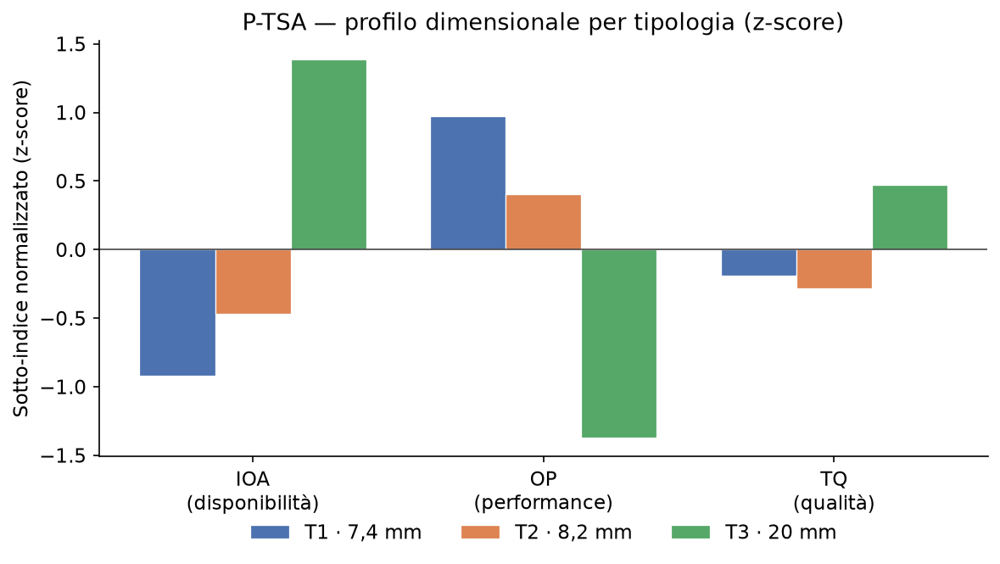
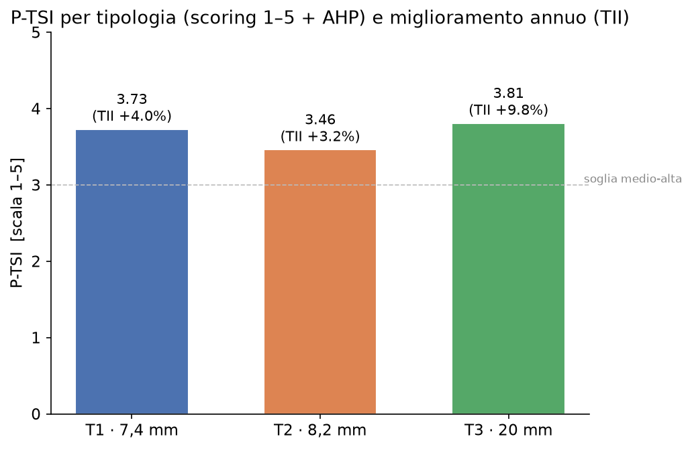

> **SusTainable dAta-dRiven manufacTuring**
> Accordo Innovazione DM 31/12/2021 — Prog. n. F/310087/01-05/X56
> www.start-innovability.it

# PRODUCT TECHNOLOGICAL SUSTAINABILITY ASSESSMENT (P-TSA)

**Relazione Parziale N°:** RP7.4
**Versione del Documento:** V1.0
**Data di Revisione del Documento:** 07.08.2026
**Responsabilità:** Gresmalt — Capofila

---

## 1. INTRODUZIONE

### 1.1 Inquadramento dell'attività
L'attività 7.4 estende al **prodotto** la valutazione di sostenibilità
tecnologica che l'attività 7.3 conduce sulla **fabbrica**. Se l'OR7.3 misura, con
l'Extended Exergy Accounting Plus (EEA+), la sostenibilità del *sistema
produttivo*, l'OR7.4 completa il quadro determinando in modo quantitativo le
prestazioni tecniche del *prodotto ceramico* e la loro conformità al quadro
normativo dei materiali ceramici. Il Piano di Sviluppo assegna all'attività
l'applicazione della metodologia **P-TSA** secondo l'approccio del ciclo di vita
(Life Cycle Thinking, LCT) e lo schema della **ISO 14040**, in prospettiva di
supply chain **cradle-to-grave**, misurando la sostenibilità tecnologica rispetto
a tre categorie d'impatto: **In-/Outputs Availability (IOA)**, **Operational
Performance (OP)** e **Technical Quality (TQ)**.

### 1.2 Baseline e scopi
La baseline di progetto è nulla (0.0) per tutti i KPI. Gli obiettivi sono:
- un **indicatore per ciascuna delle tre categorie** e per **3 tipologie** di
  prodotto — *Stock Coverage Rate* (SCR) per IOA, *Productivity Indicators* (PsI)
  per OP, *Output Conformity Rate* (OCR) per TQ;
- un **indice sintetico normalizzato**, il **Product Technology Sustainability
  Index (P-TSI)**, per le **3 tipologie**.

Le tre tipologie sono definite dalle **Environmental Product Declaration (EPD,
ISO 14025 / EN 15804+A2, EPDItaly)** del gruppo, che coprono un gradiente di
spessore/massa e due dei tre stabilimenti:

| Tipologia | Spessore | Massa (unità dichiarata) | Stabilimento | Gruppo | Uso tipico |
|---|---|---|---|---|---|
| **T1** | 7,4 mm | 13,98 kg/m² | D060 Scandiano | BIa | interni, alleggerito |
| **T2** | 8,2 mm | 16,05 kg/m² | D060 Scandiano | BIa | interni/esterni, standard |
| **T3** | 20,0 mm | 41,79 kg/m² | D240 Frassinoro | BIa | esterni/outdoor, spessorato |

Tutte gres porcellanato smaltato gruppo **BIa** (assorbimento d'acqua ≤ 0,5 %,
ISO 10545-3), conformi a **EN 14411 (ISO 13006)**, cottura 1210–1230 °C. Gli EPD
sono *cradle-to-grave*, con unità dichiarata **1 m² per 1 anno** e periodo dati
**lug 2023 – giu 2024**.

### 1.3 Interdipendenze
L'attività dipende da OR6.8/6.9 (segmentazione e progettazione data-driven del
prodotto), da OR7.1–7.2 (infrastruttura Edge-to-Cloud E2C come sorgente dati) e
condivide impianto metodologico e governance del dato con OR7.3. Il P-TSI è, con
l'EEA+ Index, uno dei due KPI del **collaudo della Intelligent Industry (OR7.8)**
e concorre alla caratterizzazione tecnologica dei prototipi di OR7.9,
contribuendo al Risultato Finale RF7.

---

## 2. METODOLOGIA

### 2.1 Fondamento e schema ISO 14040
Il P-TSA applica al prodotto la logica **LCT/ISO 14040** in quattro fasi (Goal &
Scope → Inventory → Impact Assessment → Interpretation), trattando la tecnologia
come **dimensione di sostenibilità a sé stante** e non come mero abilitatore. Il
sistema-prodotto è letto lungo le **sette attività** della value chain
(Sourcing, Inbound Logistics, Operations, Internal Logistics, Outbound Logistics,
Product Usage, Waste Logistics), dal *cradle* al *grave*.

### 2.2 Unità funzionale
Coerentemente con il problema progettuale n. 4, l'unità funzionale è stata
scelta tramite prove comparate tra **1 m²**, **1 t** e **lotto di tipologia
produttiva**. Si è adottato il **lotto di tipologia produttiva** come unità
funzionale operativa (massima aderenza al controllo qualità e alla copertura
scorte), mantenendo la **normalizzazione a 1 m²** — la stessa unità dichiarata
degli EPD — come riferimento di comparabilità trasversale tra le tre tipologie e
con OR7.3.

### 2.3 Categorie d'impatto e indicatori
Per ciascuna categoria è costruito un indicatore generale (Vacchi et al., 2021):

- **IOA → SCR** (*Stock Coverage Rate*) = Stock medio / Consumo medio [giorni],
  su tre input della catena: materie prime (Sourcing), prodotto finito (Internal
  Logistics), smalti/engobbi/inchiostri (Operations).
- **OP → PsI** (*Productivity Indicators*) = Output reale / Input reale, su tre
  metriche: produttività energetica [m²/GJ], resa di materiale [m² vendibili / m²
  pressati], throughput di linea [m²/h].
- **TQ → OCR** (*Output Conformity Rate*) = Parametro qualità / Soglia di
  accettabilità normativa, su tre parametri della serie **ISO 10545** con soglie
  **EN 14411 BIa**: resistenza a flessione (ISO 10545-4, soglia 35 N/mm²), sforzo
  di rottura (ISO 10545-4, soglia 700 N per spessori < 7,5 mm / 1300 N per ≥ 7,5
  mm), qualità superficiale (ISO 10545-2, soglia 95 % prima scelta).

### 2.4 Normalizzazione e aggregazione
Si adottano **due schemi**, con verifica incrociata:

- **Primario — z-score + pesi uguali** (aderente a Vacchi 2021): ogni indicatore
  è standardizzato *z = (x − μ) / σ* tra le tre tipologie; i sotto-indici
  **IOAI, OPI, TQI** sono la media (pesi uguali) degli z della categoria; il
  **P-TSI** è la media dei tre sotto-indici. Lettura **relativa/comparativa** tra
  tipologie (media 0).
- **Secondario — scoring 1–5 + AHP** (aderente a RP7.3 / O-TSA 2025): ogni
  indicatore è mappato su una scala 1–5 tramite soglie; i pesi entro e tra le
  dimensioni derivano da **Analytic Hierarchy Process**, con verifica del
  **Consistency Ratio (CR ≤ 0,10)**. Lettura **assoluta** in [1–5] per tipologia.

Il confronto **temporale** è dato dal **Technology Improvement Index (TII)**,
variazione percentuale del P-TSI tra due periodi.

### 2.5 Architettura dati
La pipeline è alimentabile indifferentemente da serie storiche **ERP/MES** e da
dati in tempo reale **E2C** (stessa logica di OR7.3). Gli artefatti di calcolo
— `RP7.4_data_collection.xlsx`, `RP7.4_weights.xlsx`, `RP7.4_calculation_log.xlsx`
— replicano la struttura di RP7.3 e sono versionati e tracciabili; le serie sono
in corso di consolidamento.

---

## 3. RISULTATI

### 3.1 Energia specifica di processo (Tabella 1)
| Tipologia | Massa [kg/m²] | Energia specifica processo [MJ/m²] |
|---|---|---|
| T1 · 7,4 mm | 13,98 | 42,6 |
| T2 · 8,2 mm | 16,05 | 49,0 |
| T3 · 20 mm | 41,79 | 127,5 |

*Tabella 1 — Intensità energetica di processo per m² (∝ massa; ancoraggio a
RP7.3 D060/D240).*

### 3.2 Indicatori per categoria (Tabelle 2–4)

**IOA — Stock Coverage Rate [giorni]**

| SCR | T1 · 7,4 mm | T2 · 8,2 mm | T3 · 20 mm |
|---|---|---|---|
| Materie prime (Sourcing) | 40,0 | 46,0 | 83,9 |
| Prodotto finito (Internal Logistics) | 29,7 | 33,8 | 57,8 |
| Smalti/inchiostri (Operations) | 22,9 | 26,0 | 33,3 |

*Tabella 2 — SCR per input e tipologia.*

**OP — Productivity Indicators**

| PsI | Unità | T1 · 7,4 mm | T2 · 8,2 mm | T3 · 20 mm |
|---|---|---|---|---|
| Produttività energetica | m²/GJ | 22,49 | 19,41 | 7,34 |
| Resa di materiale | m²/m² | 0,962 | 0,955 | 0,941 |
| Throughput di linea | m²/h | 640 | 560 | 210 |

*Tabella 3 — PsI per metrica e tipologia.*

**TQ — Output Conformity Rate [QP/AT]**

| OCR | Norma / soglia | T1 · 7,4 mm | T2 · 8,2 mm | T3 · 20 mm |
|---|---|---|---|---|
| Resistenza a flessione | ISO 10545-4 / ≥35 N/mm² | 1,371 | 1,429 | 1,514 |
| Sforzo di rottura | ISO 10545-4 / ≥700–1300 N | 2,000 | 1,577 | 5,538 |
| Qualità superficiale | ISO 10545-2 / ≥95 % | 1,027 | 1,022 | 1,015 |

*Tabella 4 — OCR per parametro e tipologia (valori ≥ 1 = conforme con margine).*

### 3.3 Sotto-indici e P-TSI — metodo primario (Tabella 5, Figura 1)

| Tipologia | IOAI (z) | OPI (z) | TQI (z) | **P-TSI (z)** |
|---|---|---|---|---|
| T1 · 7,4 mm | −0,920 | +0,970 | −0,191 | **−0,047** |
| T2 · 8,2 mm | −0,466 | +0,403 | −0,280 | **−0,115** |
| T3 · 20 mm | +1,385 | −1,372 | +0,472 | **+0,162** |

*Tabella 5 — Sotto-indici z-score e P-TSI (pesi uguali). Ordinamento: **T3 > T1 > T2**.*

*Figura 1 — Profilo dimensionale (z-score): T3 forte su IOA e TQ, debole su OP;
T1 profilo speculare (forte OP).*

### 3.4 Sotto-indici e P-TSI — metodo secondario (Tabella 6, Figura 2)

| Tipologia | S_IOA [1–5] | S_OP [1–5] | S_TQ [1–5] | **P-TSI (1–5)** | **TII** |
|---|---|---|---|---|---|
| T1 · 7,4 mm | 3,80 | 4,75 | 3,14 | **3,73** | +3,97 % |
| T2 · 8,2 mm | 4,00 | 4,00 | 3,00 | **3,46** | +3,19 % |
| T3 · 20 mm | 5,00 | 1,50 | 4,71 | **3,81** | +9,84 % |

*Tabella 6 — Punteggi dimensionali (scoring 1–5), P-TSI ponderato AHP e TII.
Ordinamento: **T3 > T1 > T2**. Pesi AHP tra dimensioni: IOA 0,163 · OP 0,297 ·
TQ 0,540; CR = 0,0079 ≤ 0,10 (consistente).*

*Figura 2 — P-TSI (scala 1–5) e miglioramento annuo (TII) per tipologia.*

### 3.5 Analisi di sensibilità (Tabella 7)

| Scenario | Ordinamento |
|---|---|
| **z-score + pesi uguali (primario)** | **T3 > T1 > T2** |
| z-score + pesi AHP (TQ>OP>IOA) | T3 > T1 > T2 |
| scoring 1–5 + AHP | T3 > T1 > T2 |
| scoring 1–5 + pesi uguali | T1 > T2 > T3 |
| z-score focus OP (0,25/0,50/0,25) | T1 > T2 > T3 |
| z-score focus disponibilità/qualità (0,40/0,20/0,40) | T3 > T2 > T1 |

*Tabella 7 — Stabilità dell'ordinamento. **T3 primeggia in 3 scenari su 6** (tutti
quelli in cui disponibilità e qualità hanno peso normale o superiore); **T1** primeggia
quando si privilegia l'efficienza operativa; **T2 non è mai primo**.*

### 3.6 Verifica dei KPI di attività (Tabella 8)

| KPI | Baseline | Obiettivo | Risultato |
|---|---|---|---|
| SCR (IOA) | 0.0 | Indicatore per 3 tipologie | 3 SCR × 3 tipologie calcolati |
| PsI (OP) | 0.0 | Indicatore per 3 tipologie | 3 PsI × 3 tipologie calcolati |
| OCR (TQ) | 0.0 | Indicatore per 3 tipologie | 3 OCR × 3 tipologie calcolati |
| **P-TSI** | 0.0 | Indice per 3 tipologie | **3 P-TSI** (z-score e scoring/AHP) |
| Consistenza AHP | — | CR ≤ 0,10 | CR = 0,0079 (consistente) |

*Tabella 8 — Verifica dei KPI di attività: obiettivi raggiunti.*

---

## 4. DISCUSSIONE E CONCLUSIONI

### 4.1 Lettura dei risultati
Il P-TSA restituisce **profili tecnologici nettamente differenziati** tra le tre
tipologie, coerenti con la loro natura fisica e d'uso:
- **T3 (20 mm, outdoor/spessorato)** è il prodotto tecnologicamente più
  sostenibile secondo il metodo primario: eccelle in **disponibilità (IOA)** —
  scorte ampie lungo la catena — e in **qualità tecnica (TQ)** — sforzo di rottura
  strutturale molto elevato — ma è il più debole in **performance operativa (OP)**
  per l'elevata intensità energetica (127,5 MJ/m²) e il basso throughput.
- **T1 (7,4 mm, alleggerito)** ha il profilo speculare: **massima efficienza
  operativa** (energia, throughput) ma minore copertura scorte e minor margine di
  resistenza; è primo quando l'analisi privilegia l'efficienza operativa.
- **T2 (8,2 mm, standard)** è la tipologia mediana e **non risulta mai prima** in
  nessuno scenario: emerge come **principale candidato al miglioramento**.

### 4.2 Robustezza e ponderazione
La convergenza tra **metodo primario (z-score)** e **scoring + AHP** sull'ordine
T3 > T1 > T2 costituisce una **validazione incrociata**. L'analisi di sensibilità
mostra però che l'ordine dei primi due (T3 vs T1) **dipende dal peso attribuito
alla performance operativa**: privilegiando l'OP, T1 supera T3. Questa non è una
debolezza ma un'informazione decisionale: la scelta della tipologia "più
sostenibile" è esplicitamente funzione della priorità strategica
(disponibilità/qualità *vs* efficienza operativa), resa trasparente dai pesi AHP
(CR = 0,0079). Il P-TSI positivo del TII per tutte le tipologie (+3 ÷ +10 %)
indica un miglioramento tendenziale, massimo per T3.

### 4.3 Interdipendenze e contributo al progetto
La RP7.4 chiude, sul versante prodotto, il sistema di misura della sostenibilità
tecnologica del progetto: insieme all'EEA+ di OR7.3 fornisce i due indici
(P-TSI ed EEA+I) del **collaudo della Intelligent Industry (OR7.8)** e alimenta
la caratterizzazione dei prototipi di OR7.9. Riusa l'infrastruttura E2C
(OR7.1–7.2) e l'impianto AHP/controlli di OR7.3, garantendo omogeneità
metodologica tra la scala di fabbrica e quella di prodotto.

### 4.4 Contributo rispetto allo stato dell'arte
Il P-TSA porta a livello di **prodotto ceramico** una misura della sostenibilità
**tecnologica** oggi assente dai framework prevalenti (LCA, GRI, SDG la trattano
solo come abilitatore). Ancorando gli indicatori a metriche di supply chain
(SCR/PsI/OCR) e alla conformità normativa (ISO 10545 / EN 14411), e rendendo
esplicita la ponderazione via AHP, l'assessment trasforma dati operativi
frammentati in un **indice sintetico, interpretabile e auditabile** per tipologia,
utilizzabile come leva decisionale (razionalizzazione di gamma, priorità di
miglioramento) e come variabile per l'ottimizzazione multi-obiettivo della
Intelligent Industry.

### 4.5 Prospettive
Il percorso verso il consolidamento riguarderà: l'estensione del calcolo a
granularità di lotto sull'intero portafoglio (OR6.8), la calibrazione delle
soglie e dei pesi in workshop con produzione/qualità/manutenzione, e la lettura
mensile del P-TSI su 12 mesi per il collaudo OR7.8, fino all'integrazione del
P-TSI come variabile di controllo nel Digital Twin di prodotto.

---

### Allegati
- `RP7.4_data_collection.xlsx` — schede di raccolta dati per tipologia/attività/periodo.
- `RP7.4_weights.xlsx` — soglie di scoring e matrici AHP (pesi + CR).
- `RP7.4_calculation_log.xlsx` — log di calcolo versionato (formula → input → output).
- `RP7.4_Impostazione_e_Background_P-TSA.md` — documento di impostazione e background.
- Figure: `RP7.4_fig1_profilo_dimensionale.png`, `RP7.4_fig2_ptsi_tii.png`.
