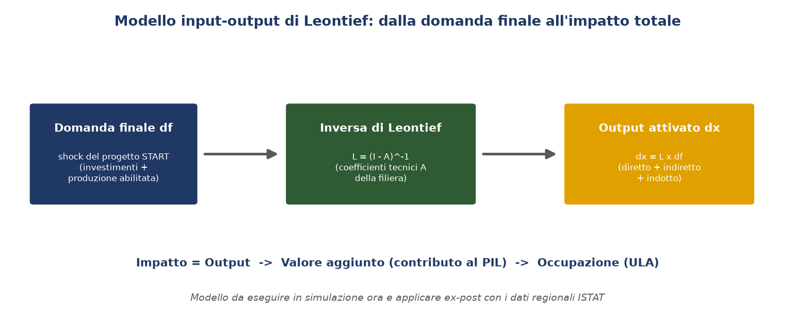
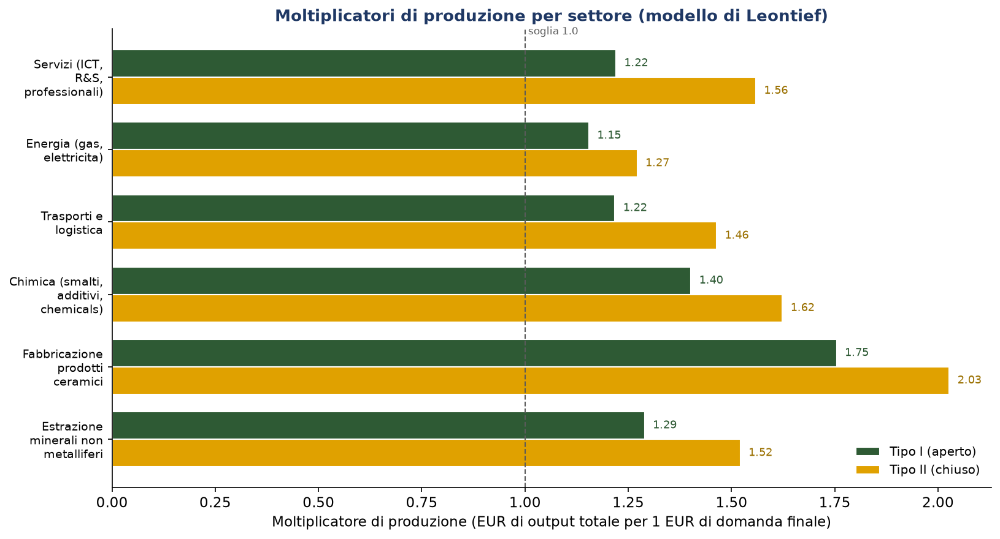
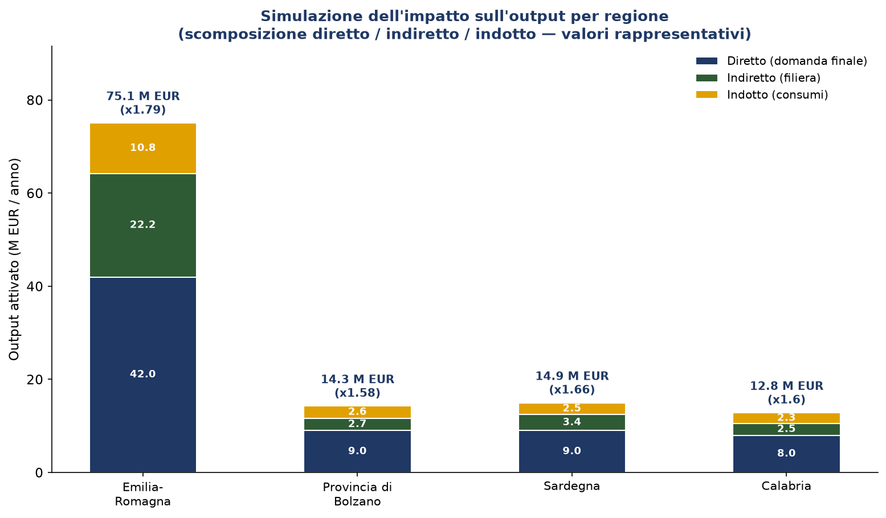
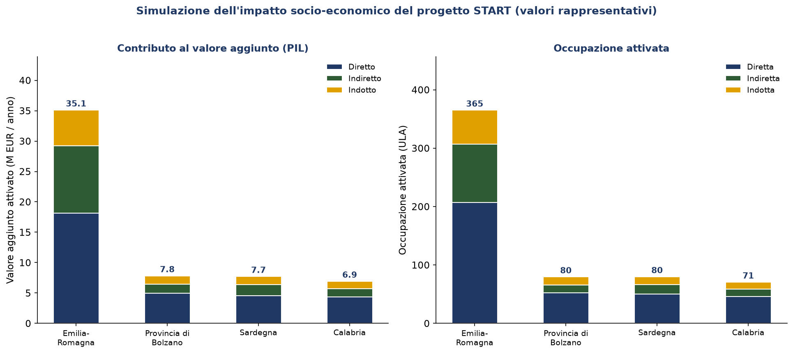

# RP 8.6 — Report sulla valutazione d'impatto del progetto

*Simulazione dell'impatto e modello analitico per la valutazione ex‑post*

**Progetto:** START | *SusTainable dAta-dRiven manufacTuring* — DM 31 dicembre 2021, Accordi per l'Innovazione (MIMIT)
**Obiettivo Realizzativo:** OR 8 — Project management, misurazione dei risultati e analisi degli scostamenti (Sviluppo Sperimentale)
**Attività:** 8.6 — Assessment dell'impatto di START
**Risultato parziale / KPI:** Report sulla valutazione d'impatto — *Analisi / Matrice input‑output* (baseline: Nessuna informazione → obiettivo: Analisi effettuata)
**Risultato finale di OR:** RF 8 — Piano di Coordinamento del Progetto START
**Responsabilità:** Gresmalt — Capofila (in collaborazione con le Università), Resp. progetto Davide Settembre Blundo
**Versione del documento:** R1.0 — **Data:** 07.08.2026

---

> **Natura di questa relazione.** In assenza dei dati macroeconomici regionali (problema progettuale
> n. 6), l'attività 8.6 è impostata come **simulazione dell'impatto potenziale** e, soprattutto, come
> **predisposizione e validazione del modello analitico** input‑output da applicare **ex‑post** — nei
> mesi e negli anni successivi alla chiusura del progetto — con i consuntivi degli investimenti e le
> tavole input‑output regionali ISTAT. Il deliverable è quindi lo **strumento** (matrice/modello
> riproducibile + protocollo di misurazione), coerente con la logica di «analisi degli scostamenti»
> dell'OR 8; i valori riportati sono l'esito di una **simulazione con dati rappresentativi** e servono
> a dimostrare l'operatività del modello e l'ordine di grandezza degli effetti attesi, **non**
> costituiscono una misura consuntiva dell'impatto.

## 1. Introduzione

### 1.1 Background

L'OR 8 attribuisce a START una finalità dichiarata come **inedita per i progetti di R&S a carattere
industriale**: la **valutazione dell'impatto del progetto sulla società di riferimento e sui
territori**. L'attività 8.6, svolta in collaborazione con le Università del partenariato, ne
predispone lo strumento: un **modello di analisi input‑output** — sul modello econometrico di
**Wassily Leontief** — capace di stimare l'impatto diretto, indiretto e indotto dei risultati del
progetto sui quattro territori dove operano le attività industriali e di ricerca: l'**Emilia‑Romagna**
(cuore del distretto ceramico di Sassuolo, sede di Gresmalt e SACMI), la **Provincia di Bolzano**
(Libera Università di Bolzano — concetto globale di Digital Twin e AI), la **Sardegna** (Università di
Sassari — Architectural Design 4.0+ e involucro edilizio ceramico) e la **Calabria** (Università della
Calabria — modelli ML/ANN e diagnostica non distruttiva). Poiché la misura consuntiva richiede dati
non ancora disponibili, l'attività si concretizza in una **simulazione** che valorizza il modello e ne
dimostra l'applicazione, lasciandolo pronto per la **misurazione ex‑post**.

I risultati di START — la transizione *Smart Factory → Intelligent Factory → Intelligent Industry*
guidata dall'AI, le quattro impronte di sostenibilità e la contabilità exergetica EEA+, l'architettura
Edge‑to‑Cloud, il data‑driven product design, il collaudo in ambiente operativo — attivano produzione,
valore aggiunto e occupazione non solo nell'impresa focale ma lungo tutta la filiera locale
(estrazione, chimica, logistica, energia, servizi/R&S) e attraverso i consumi indotti dai redditi
generati. L'analisi input‑output è lo strumento elettivo per **catturare questi effetti a cascata**.

### 1.2 Il problema dei dati, la scelta della simulazione e il legame con la RP 8.5

L'analisi input‑output di impatto richiede **dati macroeconomici su scala regionale** (tavole
input‑output/SUT, coefficienti settoriali) e **consuntivi degli investimenti** del progetto, **non
direttamente disponibili** al Team durante la vita del progetto (**problema progettuale n. 6**). Per
questo l'attività 8.6 **non pretende una misura definitiva dell'impatto**, ma:

1. **imposta e valida il modello analitico** (matrice dei coefficienti tecnici, inversa di Leontief,
   moltiplicatori) parametrizzato sulla filiera ceramica;
2. lo **esegue in simulazione** con coefficienti **rappresentativi**, calibrati sull'ordine di
   grandezza della filiera, per dimostrarne l'operatività e stimare gli effetti attesi;
3. definisce il **protocollo di applicazione ex‑post** (§ 2.5) per ri‑eseguirlo con i dati ufficiali.

La soluzione prevista in scheda per l'accesso ai dati è, in accordo con il **Piano di Stakeholder
Engagement (RP 8.5)**, il **coinvolgimento delle autorità territoriali** (ISTAT, uffici statistici
regionali e provinciali): **RP 8.5 è quindi il presupposto della misurazione ex‑post** qui predisposta.

### 1.3 Baseline

La **baseline** del KPI è **«Nessuna informazione»**: prima dell'attività 8.6 non esiste un modello di
analisi input‑output dell'impatto territoriale del progetto. L'**obiettivo** è l'**analisi
effettuata**, intesa qui come il **modello (matrice I‑O) impostato ed eseguito in simulazione** sulle
quattro regioni (output, valore aggiunto, occupazione) e pronto per l'applicazione ex‑post: lo
*strumento* è il risultato, il dato consuntivo verrà dopo.

### 1.4 Scopi dell'attività

- **impostare e validare** il modello input‑output di Leontief per la filiera ceramica (coefficienti
  tecnici, inversa di Leontief, moltiplicatori Tipo I/II);
- **simulare** l'impatto diretto, indiretto e indotto del progetto su Emilia‑Romagna, Provincia di
  Bolzano, Sardegna e Calabria in termini di output, valore aggiunto (contributo al PIL) e occupazione,
  con valori rappresentativi;
- **definire il protocollo di applicazione ex‑post** per ri‑eseguire il modello con le tavole I‑O
  regionali ISTAT e i consuntivi (via RP 8.5), alimentando l'analisi degli scostamenti dell'OR 8;
- **produrre il Report di valutazione d'impatto** (KPI: analisi effettuata) come strumento
  riproducibile del Piano di Coordinamento (RF 8).

---

## 2. Metodologia

### 2.1 Il modello input‑output di Leontief

L'analisi input‑output rappresenta le interdipendenze tra i settori di un'economia. Data la **matrice
dei coefficienti tecnici** A, dove *aᵢⱼ* è l'input dal settore *i* necessario per produrre un'unità di
output del settore *j*, la produzione totale **x** che soddisfa una domanda finale **f** è
**x = A·x + f**, da cui:

$$ x = (I - A)^{-1} \, f = L \, f $$

dove **L = (I − A)⁻¹** è la **matrice inversa di Leontief**. Applicata a una variazione della domanda
finale **Δf** (lo *shock* del progetto), fornisce la variazione della produzione totale **Δx = L·Δf**,
che incorpora gli effetti a cascata lungo la filiera (Leontief, 1936; Miller & Blair, 2009). Lo schema
del modello è in Figura 1.



*Figura 1. Dalla domanda finale del progetto, tramite l'inversa di Leontief, all'output attivato e alle sue dimensioni di impatto (valore aggiunto, occupazione).*

### 2.2 Effetti diretti, indiretti e indotti; moltiplicatori Tipo I e Tipo II

L'impatto si scompone in tre componenti:
- **diretto** — la domanda finale attivata dal progetto (Δf);
- **indiretto** — la produzione attivata lungo la **filiera dei fornitori** (Δx − Δf nel modello
  aperto);
- **indotto** — la produzione attivata dai **consumi delle famiglie** finanziati dai redditi da lavoro
  generati (effetto reddito).

Di conseguenza si calcolano due famiglie di **moltiplicatori** di produzione:
- **Tipo I** — modello *aperto* (diretto + indiretto): somma per colonna della matrice L;
- **Tipo II** — modello *chiuso* rispetto alle famiglie (diretto + indiretto + indotto): la matrice A
  è estesa con una riga (redditi da lavoro per unità di output) e una colonna (consumi per unità di
  reddito), e si ricalcola l'inversa.

L'impatto su **valore aggiunto** (contributo al PIL) e **occupazione** si ottiene applicando all'output
attivato i rispettivi coefficienti settoriali (quota di valore aggiunto sull'output; unità di lavoro,
ULA, per milione di euro di output).

### 2.3 Settori, coefficienti e shock del progetto (parametri di simulazione)

Il modello adotta **sei settori** rappresentativi della filiera ceramica e del suo indotto
territoriale: estrazione di minerali non metalliferi; fabbricazione di prodotti ceramici; chimica
(smalti, additivi, chemicals); trasporti e logistica; energia; servizi (ICT, R&S, professionali —
comparto che in START incorpora l'AI, il digital twin e la progettazione). Lo **shock di domanda
finale** del progetto (investimenti e produzione addizionale abilitata dalla transizione verso
l'Intelligent Industry) è **differenziato per regione** secondo il ruolo del soggetto attuatore:
concentrato su ceramica/estrazione/chimica/logistica/energia in **Emilia‑Romagna**; orientato a
ricerca, ICT/R&S e servizi in **Provincia di Bolzano** e **Calabria**; orientato a
servizi/progettazione e applicazione del prodotto ceramico (involucro edilizio) in **Sardegna**. Nella
simulazione questi parametri sono **rappresentativi** e costituiscono gli *ingressi provvisori* del
modello, destinati a essere sostituiti in sede di applicazione ex‑post (§ 2.5).

> La **struttura** del modello (settori, matrice A, coefficienti di VA e occupazione) coincide con
> quella impiegata per il progetto gemello VOLT (RP 9.6): i due progetti insistono sulla stessa
> industria e sullo stesso distretto ceramico, per cui i coefficienti tecnici della filiera sono i
> medesimi. Ciò che è stato ricalibrato per START è la **ripartizione regionale dello shock** sui
> quattro territori della scheda.

### 2.4 Trattamento dei dati e riproducibilità

Coerentemente con il problema n. 6, i coefficienti della matrice A, i coefficienti di valore aggiunto
e occupazione e lo shock di domanda finale sono **rappresentativi**, calibrati sull'ordine di
grandezza della filiera; **non contengono dati riservati** e vanno **consolidati** con le **tavole
input‑output regionali ISTAT** (SUT/IO) il cui accesso passa dal coinvolgimento delle autorità
territoriali previsto nella RP 8.5. Il modello è codificato e riproducibile (`RP8.6/src/impatto.py`,
`RP8.6/run_impatto.py`), con export `RP8.6/output/impatto_*.csv` per il cruscotto Power BI:
ri‑eseguirlo con i dati ufficiali è sufficiente a produrre la stima consuntiva senza modificare la
struttura analitica.

### 2.5 Protocollo di applicazione ex‑post

Il valore dell'attività 8.6 è il modello e il suo **protocollo di applicazione ex‑post**, da attivare
nei **mesi e anni successivi alla chiusura del progetto** secondo quattro passi:

1. **Acquisizione dati** — tramite il coinvolgimento delle autorità territoriali (RP 8.5): tavole
   **input‑output regionali ISTAT** (SUT/IO) per la matrice A e i coefficienti settoriali;
   **consuntivi degli investimenti** e della produzione addizionale del progetto per lo shock di
   domanda finale reale.
2. **Ricalibrazione** — sostituzione dei coefficienti e dello shock rappresentativi con i valori
   ufficiali, mantenendo invariata la struttura del modello.
3. **Ri‑esecuzione** — nuovo calcolo di output, valore aggiunto e occupazione (diretti/indiretti/
   indotti) e dei moltiplicatori, per ottenere la **stima consuntiva** dell'impatto.
4. **Analisi degli scostamenti** — confronto tra impatto **simulato** (previsione, questa relazione)
   e impatto **consuntivo** (ex‑post), coerentemente con l'oggetto stesso dell'OR 8; gli scostamenti
   alimentano il Piano di Coordinamento (RF 8).

**Tabella — Stato attuale (simulazione) vs applicazione ex‑post.**

| Elemento | Ora (simulazione, RP 8.6) | Ex‑post (misurazione) |
|---|---|---|
| Matrice dei coefficienti tecnici A | Rappresentativa (filiera ceramica) | Tavole I‑O regionali ISTAT |
| Shock di domanda finale | Stimato (investimenti + produzione attesa) | Consuntivi del progetto |
| Coefficienti VA / occupazione | Rappresentativi | Contabilità regionale / ISTAT |
| Esito | Impatto **potenziale** (ordine di grandezza) | Impatto **consuntivo** verificabile |
| Uso | Validazione del modello, stima attesa | Analisi degli scostamenti (OR 8) |

---

## 3. Risultati della simulazione

> I risultati che seguono sono l'esito della **simulazione** del modello con parametri
> rappresentativi (§ 2.3): dimostrano l'operatività dello strumento e l'ordine di grandezza degli
> effetti attesi, e saranno riprodotti con i dati ufficiali secondo il protocollo ex‑post (§ 2.5).
> I **moltiplicatori** (§ 3.1) sono la componente più robusta del modello, perché dipendono dalla
> struttura dei coefficienti tecnici più che dall'entità dello shock.

### 3.1 Moltiplicatori di produzione della filiera

I moltiplicatori di produzione per settore (Figura 2) misurano l'output totale attivato in regione per
ogni euro di domanda finale. Il settore **ceramico** ha il moltiplicatore più elevato (**1,75** di
Tipo I, **2,03** di Tipo II), coerentemente con la sua posizione di *cuore* della filiera e con la
ricchezza dei legami a monte (estrazione, chimica, energia, logistica); seguono chimica (1,40/1,62) ed
estrazione (1,29/1,52). L'inclusione dell'effetto indotto (Tipo II) accresce sensibilmente i
moltiplicatori dei settori a maggiore intensità di lavoro (servizi: da 1,22 a 1,56).



*Figura 2. Moltiplicatori di produzione: il settore ceramico traina l'attivazione dell'output regionale.*

**Tabella 1 — Moltiplicatori di produzione per settore.**

| Settore | Tipo I (aperto) | Tipo II (chiuso) |
|---|:--:|:--:|
| Estrazione minerali non metalliferi | 1,29 | 1,52 |
| Fabbricazione prodotti ceramici | 1,75 | 2,03 |
| Chimica (smalti, additivi, chemicals) | 1,40 | 1,62 |
| Trasporti e logistica | 1,22 | 1,46 |
| Energia (gas, elettricità) | 1,15 | 1,27 |
| Servizi (ICT, R&S, professionali) | 1,22 | 1,56 |

### 3.2 Impatto simulato sull'output per regione

Nella simulazione (Figura 3), in **Emilia‑Romagna** i **42,0 M€** di domanda finale diretta
attiverebbero complessivamente **75,1 M€** di output (indiretto 22,2 M€; indotto 10,8 M€), con un
**moltiplicatore di 1,79**. Nelle tre regioni della ricerca lo shock è più contenuto e orientato a
settori (servizi, R&S) con legami a monte meno intensi rispetto al core ceramico, con moltiplicatori
compresi tra 1,58 e 1,66: **Sardegna** 9,0 → **14,9 M€** (×1,66), **Provincia di Bolzano** 9,0 →
**14,3 M€** (×1,58), **Calabria** 8,0 → **12,8 M€** (×1,60). Complessivamente, **68,0 M€** di domanda
diretta attiverebbero **~117 M€** di output totale (moltiplicatore medio **1,72**).



*Figura 3. Simulazione dell'output attivato per regione, scomposto in diretto, indiretto (filiera) e indotto (consumi). Valori rappresentativi.*

### 3.3 Impatto simulato su valore aggiunto e occupazione

L'output attivato si tradurrebbe in **valore aggiunto** (contributo al PIL regionale) e **occupazione**
(Figura 4): **35,1 M€** di valore aggiunto e **~365 ULA** in Emilia‑Romagna; **7,8 M€** e **~80 ULA**
in Provincia di Bolzano; **7,7 M€** e **~80 ULA** in Sardegna; **6,9 M€** e **~71 ULA** in Calabria. In
totale la simulazione stima **~57,6 M€** di valore aggiunto e **~596 ULA** attivati sui quattro
territori.



*Figura 4. Simulazione del contributo al valore aggiunto (sinistra) e dell'occupazione attivata (destra), scomposti in diretto/indiretto/indotto. Valori rappresentativi.*

**Tabella 2 — Sintesi della simulazione (valori rappresentativi, per anno a regime).**

| Regione | Domanda diretta (M€) | Output totale (M€) | Moltiplicatore | Valore aggiunto (M€) | Occupazione (ULA) |
|---|:--:|:--:|:--:|:--:|:--:|
| Emilia‑Romagna | 42,0 | 75,1 | 1,79 | 35,1 | 365 |
| Provincia di Bolzano | 9,0 | 14,3 | 1,58 | 7,8 | 80 |
| Sardegna | 9,0 | 14,9 | 1,66 | 7,7 | 80 |
| Calabria | 8,0 | 12,8 | 1,60 | 6,9 | 71 |
| **Totale** | **68,0** | **117,1** | **1,72** | **57,6** | **596** |

### 3.4 Verifica del KPI

**Tabella 3 — Verifica del KPI di scheda (baseline Nessuna informazione → obiettivo Analisi effettuata).**

| Componente del deliverable | Baseline | Obiettivo | Esito |
|---|:--:|:--:|:--:|
| Matrice / modello input‑output (Leontief) impostato e validato | Nessuna informazione | Analisi effettuata | ✓ prodotto |
| Analisi eseguita in simulazione sulle 4 regioni | Nessuna informazione | Analisi effettuata | ✓ eseguita |
| Protocollo di applicazione ex‑post definito | Nessuna informazione | Analisi effettuata | ✓ definito |

Il KPI **«Analisi effettuata»** è raggiunto nel senso proprio dell'attività: lo **strumento di analisi
input‑output (matrice I‑O) è impostato, validato ed eseguito in simulazione** sulle quattro regioni, ed
è corredato del protocollo per la sua applicazione ex‑post. La misura consuntiva dell'impatto seguirà
con i dati ufficiali, secondo il § 2.5.

---

## 4. Discussione e conclusioni

### 4.1 Discussione critica

La simulazione mostra che l'impatto potenziale del progetto **eccederebbe sensibilmente lo shock
diretto**: ogni euro di domanda finale attiva ~1,72 € di output complessivo, con un contributo
rilevante degli effetti indiretti (filiera) e indotti (consumi). La differenza tra le regioni non è un
artefatto ma il riflesso della **struttura della filiera**: l'Emilia‑Romagna, sede del core ceramico,
presenta il moltiplicatore più elevato (1,79) perché il settore ceramico attiva a monte estrazione,
chimica, energia e logistica locali; le tre regioni della ricerca (1,58–1,66) attivano soprattutto
servizi e R&S, con legami a monte meno intensi ma comunque superiori all'unità — un risultato
**strutturale** che dipende dai coefficienti tecnici e resta valido a prescindere dalla taratura dello
shock. Vanno però ribaditi i limiti che motivano la natura di simulazione: (i) i **coefficienti sono
rappresentativi** e vanno sostituiti con le tavole I‑O regionali ufficiali (§ 2.5); (ii) l'analisi I‑O
assume **coefficienti tecnici fissi** e rendimenti costanti di scala, ipotesi ragionevole per impatti
marginali come quelli di un progetto ma non per grandi shock strutturali. È proprio per questo che il
deliverable è impostato come **modello da applicare ex‑post**, non come misura definitiva: i numeri
odierni sono una *previsione*, il valore duraturo è lo *strumento*.

### 4.2 Interdipendenze con altre attività e contributo a RF 8

- **RP 8.5 (Stakeholder Engagement)** — è il **presupposto operativo** di questa analisi: il
  coinvolgimento delle autorità territoriali delle quattro regioni è la via di accesso ai dati
  macroeconomici regionali che risolvono il problema n. 6 e permettono di consolidare i coefficienti
  del modello.
- **Risultati tecnici (OR 1–OR 7)** — il concetto di Digital Twin e l'AI (OR1), i modelli predittivi di
  qualità e la NDT (OR2), l'involucro edilizio intelligente (OR3), il framework e il controllo
  predittivo AI (OR4–OR5), la modellazione dell'Intelligent Industry e il product design (OR6), il
  collaudo in ambiente operativo (OR7) definiscono la **sostanza economica** dello shock di domanda
  finale (investimenti e produzione addizionale) qui valutato.
- **RF 8 (Piano di Coordinamento)** — la valutazione d'impatto è la componente di **misurazione dei
  risultati sui territori** del Piano di Coordinamento, e realizza la finalità inedita dell'OR 8.

### 4.3 Implicazioni operative rispetto alle Finalità del progetto

Disporre di un modello per stimare l'impatto territoriale traduce in **numeri argomentabili** la
Finalità di START di guidare la transizione dell'industria ceramica verso una produzione
**data‑driven e sostenibile** e di rafforzarne la competitività. Già in forma di simulazione i
risultati forniscono elementi per il dialogo con le istituzioni (regioni, provincia autonoma, comuni,
associazioni di distretto) e per la rendicontazione dell'Accordo per l'Innovazione, mostrando l'ordine
di grandezza con cui gli effetti del progetto — occupazione e valore aggiunto attivati, moltiplicatori
di filiera — ricadrebbero sui **territori di riferimento** (distretto ceramico emiliano e poli di
ricerca di Bolzano, Sardegna e Calabria). L'applicazione ex‑post trasformerà questa stima in evidenza
consuntiva, dando all'OR 8 la sua «misurazione dei risultati sui territori».

### 4.4 Limiti e sviluppi

- **Applicazione ex‑post (sviluppo principale).** Eseguire il protocollo del § 2.5: sostituire i
  coefficienti rappresentativi con le **tavole I‑O regionali ISTAT** (via autorità territoriali,
  RP 8.5) e con i **consuntivi degli investimenti**, per passare dalla stima simulata alla misura.
- **Analisi degli scostamenti.** Nella logica propria dell'OR 8, confrontare l'impatto **simulato**
  (questa relazione) con quello **consuntivo** ex‑post, alimentando l'analisi degli scostamenti del
  Piano di Coordinamento.
- **Estensione ambientale.** Affiancare all'analisi economica un modulo **input‑output ambientale**
  (emissioni, energia, exergia) per stimare anche l'impatto di decarbonizzazione e circolarità,
  agganciandolo alle impronte e alla contabilità EEA+/TSI del progetto (OR6).
- **Robustezza della simulazione.** Corredare il modello di **analisi di sensitività** sui parametri
  rappresentativi (intervalli di plausibilità dei moltiplicatori), in attesa dei dati ufficiali.

### 4.5 Conclusioni

L'attività 8.6 ha **impostato, validato ed eseguito in simulazione** il modello di analisi input‑output
dell'impatto del progetto START su Emilia‑Romagna, Provincia di Bolzano, Sardegna e Calabria, e ne ha
definito il **protocollo di applicazione ex‑post** (KPI: baseline Nessuna informazione → obiettivo
Analisi effettuata, raggiunto nel senso di *strumento predisposto ed eseguito*). La simulazione con
valori rappresentativi stima un impatto potenziale di **~117 M€ di output**, **~57,6 M€ di valore
aggiunto** e **~596 ULA** sui quattro territori (moltiplicatore medio 1,72), con l'Emilia‑Romagna
trainata dal core ceramico. Il valore del deliverable è però soprattutto il **modello riproducibile**,
pronto a essere ri‑eseguito con i dati regionali ufficiali — il cui accesso è abilitato dal Piano di
Stakeholder Engagement (RP 8.5) — nei **mesi e anni successivi alla chiusura del progetto**. Così
l'attività contribuisce al **RF 8 (Piano di Coordinamento del Progetto START)** e mette l'OR 8 nelle
condizioni di realizzare la sua finalità inedita: **misurare l'impatto del progetto sulla società e sui
territori** di riferimento, per differenza tra previsione e consuntivo.

---

## Appendice A — Riproducibilità

```bash
pip install -r requirements.txt        # numpy, pandas, matplotlib
cd RP8.6
python run_impatto.py                    # moltiplicatori, impatto per regione, KPI + output/impatto_*.csv
python scripts/gen_figures_impatto.py    # rigenera le figure della relazione
```

Modello input‑output (inversa di Leontief, moltiplicatori Tipo I/II, impatti): `RP8.6/src/impatto.py`.
Runner: `RP8.6/run_impatto.py`. Figure: `RP8.6/docs/figures/fig_imp*.png`. Nota di inquadramento:
`RP8.6/docs/RP8.5-8.6_Contesto_Preliminare.md`.

## Appendice B — Riferimenti

**Documenti di progetto.** Piano di Sviluppo START (Allegato 4, OR 8, attività 8.6); scheda KPI RP 8.6
(Analisi/Matrice input‑output, baseline Nessuna informazione → Analisi effettuata); problema
progettuale n. 6 (dati macroeconomici regionali → coinvolgimento autorità territoriali); RP 8.5 (Piano
di Stakeholder Engagement); risultati OR 1–OR 7 (Digital Twin/AI, impronte ed EEA+, E2C, Intelligent
Factory/Industry, product design, collaudo). Impostazione metodologica gemella: progetto VOLT, RP 9.6.

**Letteratura.**
- Leontief, W. (1936). *Quantitative input and output relations in the economic systems of the United
  States.* The Review of Economics and Statistics, 18(3), 105–125.
- Miller, R. E., & Blair, P. D. (2009). *Input‑Output Analysis: Foundations and Extensions* (2nd ed.).
  Cambridge University Press.
- Dietzenbacher, E., & Lahr, M. L. (Eds.) (2004). *Wassily Leontief and Input‑Output Economics.*
  Cambridge University Press.
- ISTAT. *Tavole delle risorse e degli impieghi (SUT) e tavole input‑output* (fonte di consolidamento
  dei coefficienti regionali).
