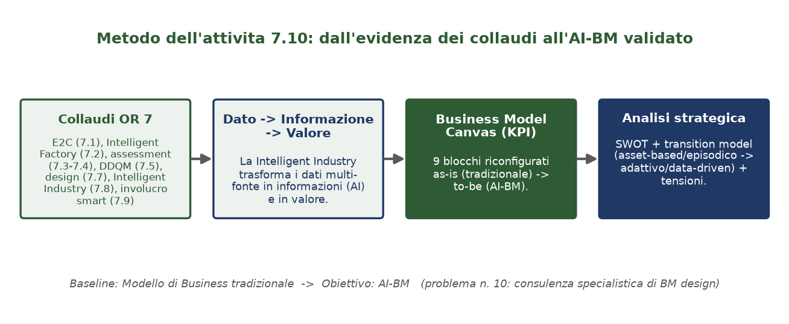
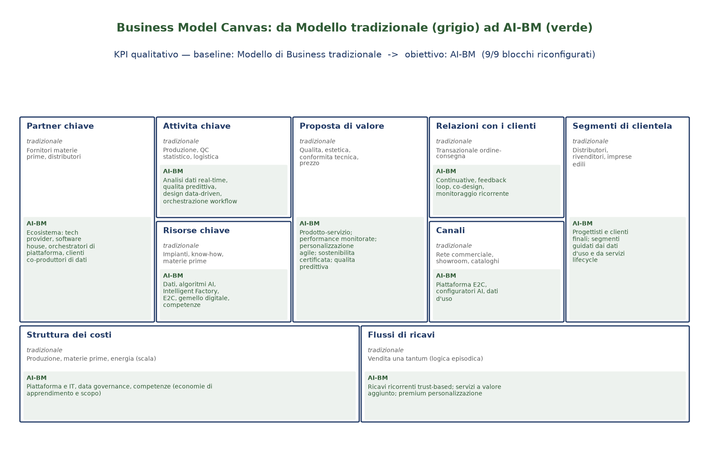
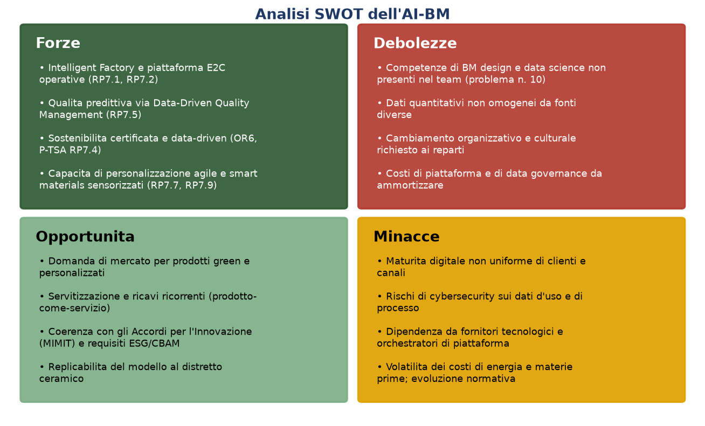
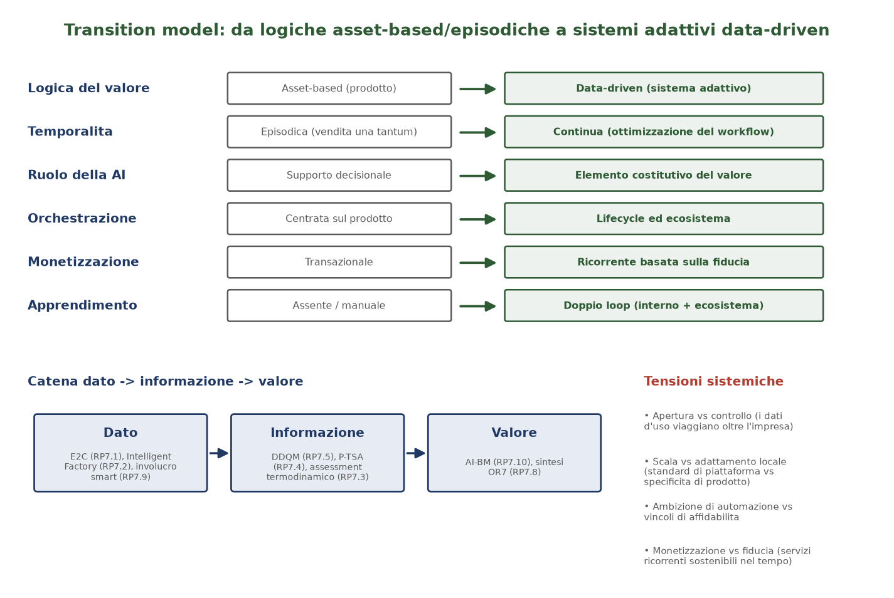
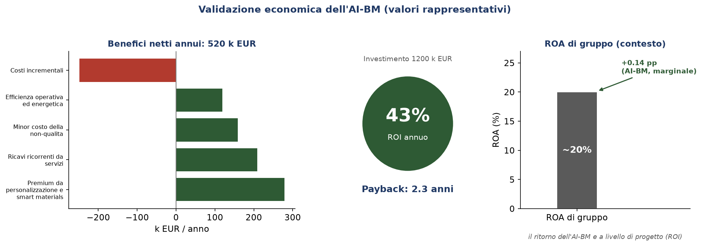

# RP 7.10 — Sviluppo di un modello di business basato sull'Intelligenza Artificiale (AI-BM)

**Progetto:** START — *SusTainable dAta-dRiven manufacTuring* (Accordo per l'Innovazione — transizione dalla Smart Factory alla Intelligent Industry a matrice ceramica)
**Obiettivo Realizzativo:** OR 7 — Validazione in ambiente operativo della *Intelligent Industry* (Sviluppo Sperimentale)
**Attività:** 7.10 — Sviluppo di un modello di business basato sull'Intelligenza Artificiale (AI-BM)
**Risultato finale di OR:** RF 7 — Documento finale di collaudo della *Intelligent Industry*
**Responsabilità:** Gresmalt S.p.A. — Capofila
**Versione del documento:** R1.0 — **Data:** 07.08.2026

---

## 1. INTRODUZIONE

### 1.1 Background

I modelli di business si sono sempre evoluti seguendo l'innovazione tecnologica. Oggi la diffusione dell'Intelligenza Artificiale (AI) sta trasformando il significato stesso di innovazione: se l'accesso alla tecnologia e alle informazioni è divenuto relativamente facile, non lo è altrettanto la **modalità con cui le imprese trasformano i dati in informazioni e le informazioni in valore**. Si rende perciò necessario lo sviluppo e l'implementazione di un nuovo **modello di business guidato dalla AI (AI-BM)** che colga le potenzialità della *Intelligent Industry* per creare e catturare valore.

RP 7.10 è l'**attività conclusiva dell'OR 7**: traduce i risultati validati nei collaudi in ambiente operativo — piattaforma edge-to-cloud (RP 7.1), *performance testing* della *Intelligent Factory* (RP 7.2), assessment termodinamico della fabbrica (RP 7.3), *Product Technological Sustainability Assessment* (RP 7.4), *Data-Driven Quality Management* (RP 7.5), ingegnerizzazione della *Intelligent Factory* (RP 7.6), *data-driven design* delle collezioni (RP 7.7), collaudo della *Intelligent Industry* (RP 7.8) e test preindustriale delle collezioni (RP 7.9) — in un **modello di business** implementabile che valorizzi la transizione verso la *Intelligent Industry*.

### 1.2 Il modello di business guidato dalla AI e la sua costruzione

La transizione all'*Intelligent Industry* non è solo una questione tecnologica ma di **modello di business**: richiede di ridefinire come l'impresa crea, distribuisce e cattura il valore lungo l'intero ciclo di vita del prodotto (Osterwalder & Pigneur, 2010; Teece, 2010). Il quadro di riferimento è quello dell'**embodied AI** proposto da Bouncken & Cesinger (2026): quando l'intelligenza è **incorporata nei sistemi fisici** — impianti, sensori di linea, involucro edilizio ceramico *smart* — la AI smette di essere semplice supporto decisionale e diventa **elemento costitutivo del valore**, attraverso cicli continui di *sensing → decision → actuation → learning*. Nell'industria ceramica ciò implica il passaggio da logiche **asset-based ed episodiche** (vendita una tantum del prodotto) a **sistemi adattivi e data-driven** (ottimizzazione continua del *workflow*, orchestrazione lifecycle, monetizzazione ricorrente basata sulla fiducia).

Il **KPI qualitativo** dell'attività è il **Business Model Canvas (BMC)**: la **baseline** è il Modello di Business tradizionale (*as-is*), l'**obiettivo** è l'AI-BM (*to-be*). Il canvas viene sviluppato in doppia versione — as-is/to-be — e la sua costruzione costituisce il **risultato di analisi strategica** richiesto dalla scheda.

### 1.3 Baseline

La **baseline** è il **Modello di Business tradizionale** dell'impresa ceramica: proposta di valore centrata sul prodotto (qualità, estetica, conformità tecnica, prezzo), ricavi transazionali una tantum, canali statici (rete commerciale, showroom, cataloghi), risorse e attività centrate su impianti e controllo qualità statistico. L'**obiettivo** è l'**AI-BM**: il canvas riconfigurato in tutti e nove i blocchi secondo la logica data-driven della *Intelligent Industry*.

### 1.4 Scopi dell'attività

- **definire e proporre l'AI-BM** che aiuti l'impresa a valorizzare la transizione verso la *Intelligent Industry*;
- **produrre il Business Model Canvas** (KPI) nella doppia versione as-is (tradizionale) → to-be (AI-BM);
- **condurre l'analisi strategica** a supporto (catena dato → informazione → valore, SWOT, transition model);
- **quantificare i vantaggi** dell'AI-BM con un modello economico (ROI e payback a livello di progetto, contributo al ROA a livello di gruppo);
- **chiudere l'OR 7** integrando i risultati dei collaudi precedenti (RP 7.1–7.9) come fonti di valore dell'AI-BM.

---

## 2. METODOLOGIA

### 2.1 Dall'evidenza dei collaudi all'AI-BM

Il metodo dell'attività (Figura 1) parte dall'**evidenza dei collaudi dell'OR 7** e la trasforma in modello di business attraverso quattro passaggi: (i) i collaudi RP 7.1–7.9 forniscono le capacità tecniche validate; (ii) la *Intelligent Industry* trasforma i **dati** multi-fonte in **informazioni** (algoritmi AI) e in **valore**; (iii) il valore viene codificato nei nove blocchi del **Business Model Canvas** (KPI), riconfigurati da *as-is* a *to-be*; (iv) l'**analisi strategica** (SWOT e transition model) ne valida il posizionamento competitivo e la coerenza con la trasformazione.



*Figura 1. Dall'evidenza dei collaudi dell'OR 7 all'AI-BM: la catena dato → informazione → valore alimenta il Business Model Canvas (KPI) e l'analisi strategica (baseline: BM tradizionale → obiettivo: AI-BM).*

### 2.2 Il Business Model Canvas come KPI

Il **Business Model Canvas** (Osterwalder & Pigneur, 2010) è adottato come strumento di strutturazione del KPI qualitativo. I nove blocchi — segmenti di clientela, proposta di valore, canali, relazioni con i clienti, flussi di ricavi, risorse chiave, attività chiave, partnership chiave, struttura dei costi — sono compilati in **doppia colonna** *as-is* (tradizionale) e *to-be* (AI-BM), rendendo esplicito, blocco per blocco, come la *Intelligent Industry* riconfigura la creazione e la cattura del valore.

### 2.3 L'impianto di analisi strategica

- **Catena dato → informazione → valore** — è il "motore" dell'AI-BM e risponde direttamente allo scopo della scheda (trasformare i dati in informazioni e le informazioni in valore). I dati di processo e d'uso (RP 7.1, RP 7.2, RP 7.9) diventano informazione tramite gli algoritmi AI (qualità predittiva RP 7.5, P-TSA RP 7.4, assessment RP 7.3) e quindi valore per il cliente (personalizzazione, sostenibilità certificata, prodotto-servizio).
- **Analisi SWOT** — inquadra il **successo competitivo** dell'AI-BM classificando i fattori interni (forze/debolezze) ed esterni (opportunità/minacce) (Helms & Nixon, 2010).
- **Transition model** — descrive il passaggio da logiche asset-based/episodiche a sistemi adattivi/data-driven lungo sei dimensioni (logica del valore, temporalità, ruolo della AI, orchestrazione, monetizzazione, apprendimento), con evidenza delle **quattro tensioni sistemiche** dell'embodied AI (Bouncken & Cesinger, 2026).
- **ROI e ROA** — misurano la **redditualità** dell'AI-BM: il ROI rapporta il beneficio netto annuo all'investimento (con il relativo *payback*); il contributo al ROA rapporta il beneficio netto al totale delle attività, collocando l'iniziativa nella scala del gruppo. Coerentemente con l'impostazione del *Circular Business Plan* di VOLT (RP 8.8), la validazione integra così l'asse **strategico** (BMC, SWOT, transition model) con quello **economico** (ROI/ROA).

### 2.4 Trattamento del problema progettuale n. 10

Un modello di business guidato dalla AI è uno strumento strategico innovativo che richiede **competenze specialistiche non presenti nel Team di Progetto** (problema progettuale n. 10). L'attività si avvale pertanto di una **consulenza specializzata di esperti in BM design**, che affianca il team nella costruzione e validazione del canvas. I dati quantitativi non omogenei, provenienti da fonti diverse, sono strutturati come informazione all'interno del canvas e dell'analisi strategica.

### 2.5 Riproducibilità

Il modello (BMC as-is/to-be, catena del valore, SWOT, transition model) è codificato e riproducibile (`src/aibm.py`, `run_collaudo_aibm.py`), con export `output/collaudo_aibm_*.csv` per il cruscotto Power BI e figure rigenerabili (`scripts/gen_figures_aibm.py`).

---

## 3. RISULTATI

### 3.1 Il Business Model Canvas dell'AI-BM (KPI)

La costruzione ha prodotto il **Business Model Canvas** nella doppia versione *as-is* (tradizionale) e *to-be* (AI-BM), portando il KPI dalla baseline (Modello di Business tradizionale) all'obiettivo (AI-BM), con tutti e nove i blocchi riconfigurati (Figura 2).



*Figura 2. Il Business Model Canvas dell'AI-BM (KPI qualitativo). Per ogni blocco: configurazione tradizionale (as-is, in grigio) e configurazione AI-BM (to-be, evidenziata in verde).*

**Tabella 1 — Business Model Canvas: as-is (tradizionale) → to-be (AI-BM).**

| # | Blocco | As-is (tradizionale) | To-be (AI-BM) | Driver AI / collaudo OR 7 |
|:--:|---|---|---|---|
| 1 | Segmenti di clientela | Distributori, rivenditori, imprese edili | Progettisti e clienti finali; segmenti guidati dai dati d'uso e servizi lifecycle | RP 7.9, RP 7.7 |
| 2 | Proposta di valore | Qualità, estetica, conformità tecnica, prezzo | Prodotto-servizio con performance monitorate, personalizzazione agile, sostenibilità certificata, qualità predittiva | RP 7.4, RP 7.5, OR6/RP 7.3 |
| 3 | Canali | Rete commerciale, showroom, cataloghi | Piattaforma edge-to-cloud (E2C), configuratori AI, canali attivati dai dati d'uso | RP 7.1, RP 7.2 |
| 4 | Relazioni con i clienti | Transazionale ordine-consegna | Continuative con feedback loop, co-design, monitoraggio ricorrente | RP 7.8 |
| 5 | Flussi di ricavi | Vendita una tantum (logica episodica) | Ricavi ricorrenti basati sulla fiducia, servizi a valore aggiunto, premium per personalizzazione | — |
| 6 | Risorse chiave | Impianti, know-how, materie prime | Dati multi-fonte, algoritmi AI, Intelligent Factory, E2C, gemello digitale, competenze, involucro sensorizzato | RP 7.1, RP 7.2, RP 7.8 |
| 7 | Attività chiave | Produzione, QC statistico, logistica | Analisi dati in tempo reale, qualità predittiva, data-driven design, assessment di sostenibilità, orchestrazione del workflow | RP 7.5, RP 7.7, RP 7.3/7.4 |
| 8 | Partnership chiave | Fornitori di materie prime, distributori | Ecosistema esteso: fornitori tecnologici, software house, orchestratori di piattaforma, partner OR, clienti co-produttori di dati | Partner OR1–OR5 |
| 9 | Struttura dei costi | Produzione, materie prime, energia (scala) | Piattaforma e IT, data governance, competenze specialistiche (economie di apprendimento e scopo) | RP 7.1 |

**Tabella 2 — Verifica del KPI.**

| KPI | Baseline | Obiettivo | Blocchi riconfigurati | Esito |
|---|---|---|:--:|:--:|
| Business Model Canvas (AI-BM) | Modello di Business tradizionale | AI-BM | 9 / 9 | ✓ prodotto |

### 3.2 La catena dato → informazione → valore

Il "motore" dell'AI-BM è la catena che trasforma i **dati** in **informazioni** e le informazioni in **valore** (Figura 4, banda inferiore): i dati storici multi-fonte delle linee (E2C, RP 7.1; *Intelligent Factory*, RP 7.2) e i dati dei sensori dell'involucro edilizio (RP 7.9) sono elaborati dagli algoritmi AI (affidabilità > 75%) per produrre qualità predittiva (DDQM, RP 7.5), indicatori di sostenibilità (footprint OR 6) e *Product Technological Sustainability Assessment* (RP 7.4); da qui discendono le proposte di valore dell'AI-BM (personalizzazione, sostenibilità certificata, prodotto-servizio, ricavi ricorrenti).

### 3.3 Analisi SWOT dell'AI-BM

L'analisi SWOT (Figura 3) evidenzia una posizione competitiva solida: le **forze** derivano dalle capacità validate nei collaudi (*Intelligent Factory* ed E2C operativi, qualità predittiva DDQM, sostenibilità certificata data-driven, personalizzazione agile con *smart materials* sensorizzati); le **debolezze** e le **minacce** individuano le aree di presidio (competenze BM/data science da acquisire — problema n. 10 —, dati non omogenei, cambiamento organizzativo, cybersecurity, dipendenza dai fornitori tecnologici); le **opportunità** confermano la coerenza con la domanda green e personalizzata, la servitizzazione, gli Accordi per l'Innovazione (MIMIT) e i requisiti ESG/CBAM, oltre alla replicabilità al distretto ceramico.



*Figura 3. Matrice SWOT: fattori interni (forze/debolezze) ed esterni (opportunità/minacce) dell'AI-BM.*

### 3.4 Il transition model e le tensioni sistemiche

Il transition model (Figura 4) sintetizza il passaggio dell'impresa lungo sei dimensioni: la **logica del valore** da asset-based a data-driven; la **temporalità** da episodica a continua; il **ruolo della AI** da supporto decisionale a elemento costitutivo del valore; l'**orchestrazione** dal prodotto al lifecycle/ecosistema; la **monetizzazione** da transazionale a ricorrente basata sulla fiducia; l'**apprendimento** verso un doppio loop (interno all'impresa ed esteso all'ecosistema). Il modello rende esplicite le **quattro tensioni sistemiche** da governare: apertura vs controllo dei dati, scala vs adattamento locale, ambizione di automazione vs vincoli di affidabilità, monetizzazione vs fiducia.



*Figura 4. Transition model (as-is → to-be) su sei dimensioni; catena dato → informazione → valore; tensioni sistemiche dell'embodied AI-BM.*

### 3.5 Quantificazione economica (ROI/ROA)

La validazione economica (Figura 5) è condotta con **valori rappresentativi**: quelli di contesto di gruppo sono calibrati sull'**ordine di grandezza** dei bilanci di gruppo Gresmalt (ricavi ~180 M€, ROA ~20%), senza riportarne le cifre riservate puntuali. A **livello di progetto** l'AI-BM presenta un **ROI annuo del ~43%** con **payback di ~2,3 anni**. A **livello di gruppo** il contributo al ROA è **marginale (+~0,14 punti percentuali)**: coerentemente con la natura incrementale dell'iniziativa (il beneficio netto annuo è pari a meno dell'1% dell'EBITDA di gruppo), il valore dell'AI-BM si esprime soprattutto a **livello di progetto** e sul piano **strategico**, non come variazione dei *ratios* aziendali. I benefici annui derivano dalle capacità validate nei collaudi dell'OR 7: premium da personalizzazione e *smart materials* (RP 7.7, RP 7.9), ricavi ricorrenti da servizi (monitoraggio, sostenibilità certificata), minor costo della non-qualità (qualità predittiva DDQM, RP 7.5) ed efficienza operativa ed energetica (*Intelligent Factory*, RP 7.2–7.3).



*Figura 5. Benefici netti annui, ROI/payback (livello di progetto) e ROA di gruppo di contesto con il contributo marginale dell'AI-BM (valori rappresentativi).*

**Tabella 3 — Sintesi della validazione economica (valori rappresentativi, k€).**

| Voce | Valore |
|---|--:|
| Investimento una tantum | 1.200 |
| Beneficio lordo annuo | 770 |
| Costi incrementali annui | 250 |
| Beneficio netto annuo | 520 |
| ROI annuo (progetto) | ~43% |
| Payback (progetto) | ~2,3 anni |
| ROA di gruppo (contesto) | ~20% |
| Contributo marginale al ROA | +~0,14 pp |

### 3.6 Esito

L'AI-BM risulta **validato su entrambi gli assi**: successo competitivo (Business Model Canvas prodotto con 9/9 blocchi riconfigurati — baseline: BM tradizionale → obiettivo: AI-BM — profilo SWOT favorevole e transition model coerente) e redditualità a livello di progetto (ROI ~43%, payback ~2,3 anni), con un contributo marginale ma positivo ai *ratios* di gruppo.

---

## 4. DISCUSSIONE E CONCLUSIONI

### 4.1 Discussione critica

RP 7.10 dimostra che i risultati tecnici dell'OR 7 sono **traducibili in un modello di business** implementabile e misurabile. L'impianto integrato è essenziale: il solo Business Model Canvas fotograferebbe la configurazione senza spiegarne la dinamica, la sola analisi strategica non ancorerebbe il valore alle capacità realmente validate nei collaudi, e la sola analisi economica non coglierebbe il valore strategico della transizione. L'integrazione degli assi **strategico** (BMC, SWOT, transition model) ed **economico** (ROI/ROA) permette di validare l'AI-BM in modo completo. La lettura dell'AI-BM come caso di **embodied AI** (Bouncken & Cesinger, 2026) coglie la specificità dell'industria ceramica *Intelligent Industry*: l'intelligenza è incorporata negli impianti, nei sensori di linea e nell'involucro edilizio, e sposta il focus **dall'efficienza all'efficacia**, dal prodotto al ciclo di vita, dalla vendita una tantum alla relazione ricorrente basata sulla fiducia.

### 4.2 Interdipendenze con altri OR e chiusura dell'OR 7

RP 7.10 è il **punto di convergenza** dell'OR 7 e integra:

- **RP 7.1 / 7.2** — piattaforma E2C e *Intelligent Factory*: canali e risorse dell'AI-BM;
- **RP 7.3 / 7.4** — assessment termodinamico e P-TSA: proposta di valore di sostenibilità certificata;
- **RP 7.5** — *Data-Driven Quality Management*: qualità predittiva come attività e proposta di valore;
- **RP 7.7 / 7.9** — *data-driven design* e involucro sensorizzato: personalizzazione e segmenti guidati dai dati;
- **RP 7.8** — collaudo della *Intelligent Industry*: relazioni continuative e doppio loop di apprendimento;
- **OR 6** — strumenti di footprint: informazione di sostenibilità che alimenta il valore.

Con RP 7.10 l'OR 7 è completo: le attività di collaudo (7.1–7.9) convergono nel **Documento finale di collaudo della *Intelligent Industry* (RF 7)**, di cui questa relazione costituisce la sintesi strategica.

### 4.3 Implicazioni operative rispetto alle Finalità del progetto

L'AI-BM rende operativa la Finalità di START di **impiegare l'AI per creare e catturare valore** lungo l'intera organizzazione, dalla fabbrica all'applicazione costruttiva. L'analisi SWOT e il transition model forniscono alla Direzione gli elementi per l'adozione e per il dialogo con gli stakeholder, inclusi i requisiti di rendicontazione ESG e degli Accordi per l'Innovazione.

### 4.4 Limiti e sviluppi

- **Dati economici.** I valori di ROI/ROA sono rappresentativi e calibrati sull'ordine di grandezza dei bilanci di gruppo; verranno consolidati con la contabilità industriale e i consuntivi delle iniziative (in particolare i ricavi ricorrenti da servizi).
- **Competenze e consulenza.** L'esito dipende dall'apporto della consulenza specialistica di BM design (problema n. 10) e dall'acquisizione interna di competenze di data science.
- **Governo delle tensioni.** L'apertura dei dati d'uso, la scalabilità della piattaforma e l'affidabilità dell'automazione richiedono presidi espliciti (data governance, cybersecurity, contratti di ecosistema).
- **Estensione.** Il modello potrà incorporare indicatori ESG/LCA come termini espliciti della proposta di valore e replicarsi ad altri attori del distretto ceramico.

### 4.5 Conclusioni

L'attività OR 7.10 ha definito e proposto un **modello di business basato sull'Intelligenza Artificiale (AI-BM)**, producendo il Business Model Canvas previsto (KPI: baseline Modello di Business tradizionale → obiettivo AI-BM, 9/9 blocchi riconfigurati) e dimostrando, con l'impianto integrato strategico-economico (catena dato → informazione → valore, SWOT, transition model, ROI/ROA), la validità dell'AI-BM in termini di successo competitivo e di redditualità a livello di progetto (ROI ~43%, payback ~2,3 anni; contributo marginale ma positivo al ROA di gruppo). Con questa relazione si **chiude l'OR 7**: i collaudi tecnici della *Intelligent Industry* trovano compimento in un modello di business implementabile e replicabile, pronto a sostenere le decisioni di adozione e le successive fasi di lancio sul mercato dei prodotti ceramici.

---

## Appendice A — Riproducibilità

```bash
pip install -r requirements.txt
python run_collaudo_aibm.py         # BMC as-is/to-be, KPI, catena del valore, SWOT, transition, ROI/ROA + output/collaudo_aibm_*.csv
python scripts/gen_figures_aibm.py  # rigenera le figure della relazione
python scripts/build_docx.py        # genera il .docx finale con la formattazione del template ufficiale
```

Modello (BMC, catena del valore, SWOT, transition, ROI/ROA): `src/aibm.py`. Runner: `run_collaudo_aibm.py`. Figure: `docs/figures/fig_aibm*.png`. Documento finale: `scripts/build_docx.py` (usa `RPX.Y Titolo_Relazione_Parziale_data.docx` come riferimento di formato).

## Appendice B — Riferimenti

**Documenti di progetto.** Piano di Sviluppo START (Allegato 4 integrato, attività 7.10); RP 7.1 (collaudo piattaforma E2C); RP 7.2 (performance testing Intelligent Factory); RP 7.3 (assessment termodinamico della fabbrica); RP 7.4 (Product Technological Sustainability Assessment); RP 7.5 (Data-Driven Quality Management); RP 7.6 (ingegnerizzazione Intelligent Factory); RP 7.7 (data-driven design delle collezioni); RP 7.8 (collaudo Intelligent Industry); RP 7.9 (test preindustriale); OR 6 (strumenti di footprint TFA+/EFA+/SFA+/EcoFA+/EEA+).

**Letteratura.**
- Bouncken, R. B., & Cesinger, B. (2026). *Embodied Artificial Intelligence (AI) business model dynamics: concept, framework, and the agriculture template.* Review of Managerial Science.
- Osterwalder, A., & Pigneur, Y. (2010). *Business Model Generation.* John Wiley & Sons.
- Teece, D. J. (2010). *Business Models, Business Strategy and Innovation.* Long Range Planning, 43(2–3), 172–194.
- Helms, M. M., & Nixon, J. (2010). *Exploring SWOT analysis – where are we now?* Journal of Strategy and Management, 3(3), 215–251.
- Geissdoerfer, M., Vladimirova, D., & Evans, S. (2018). *Sustainable business model innovation: A review.* Journal of Cleaner Production, 198, 401–416.
