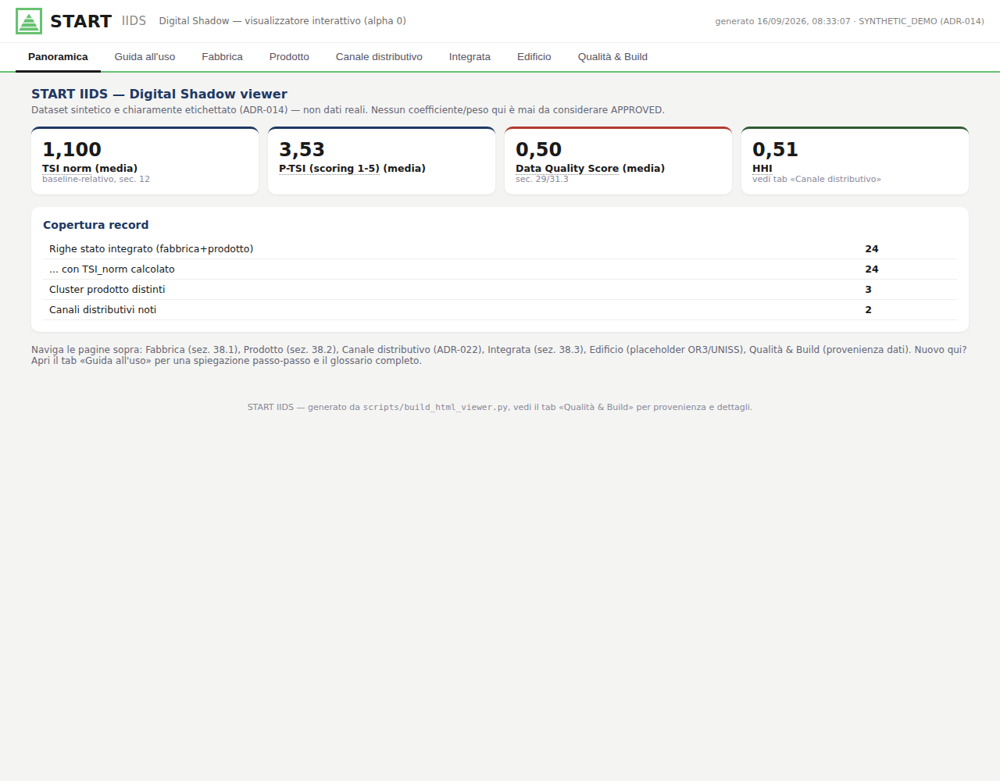
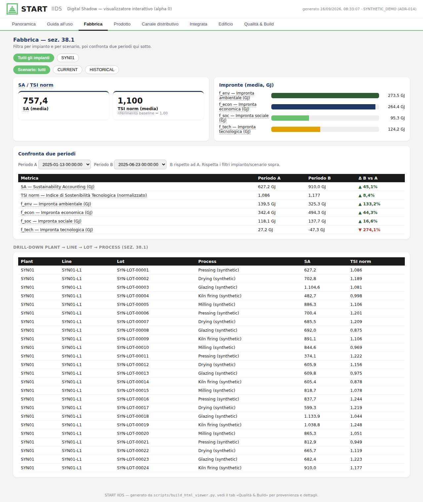
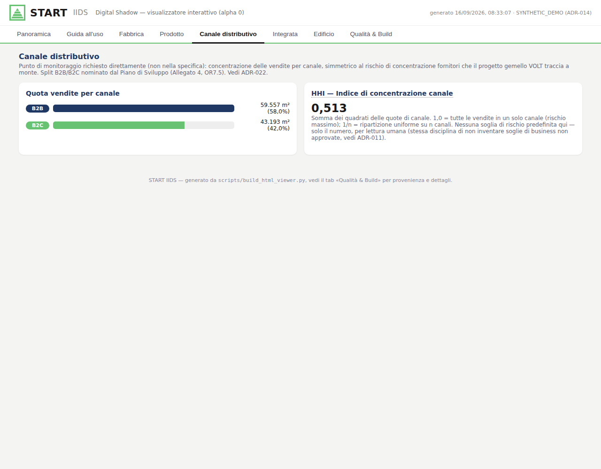
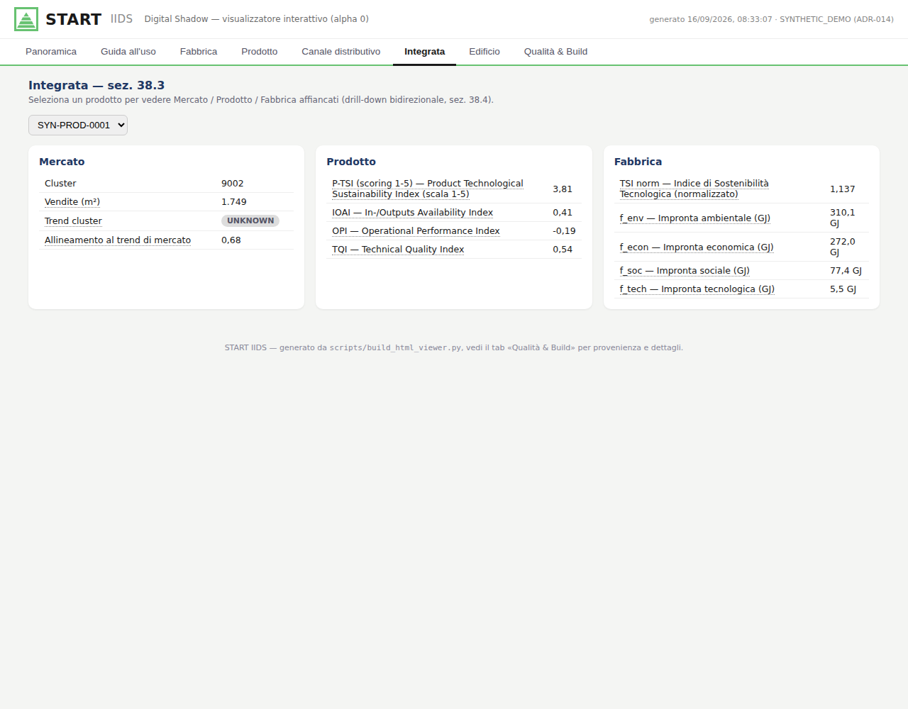
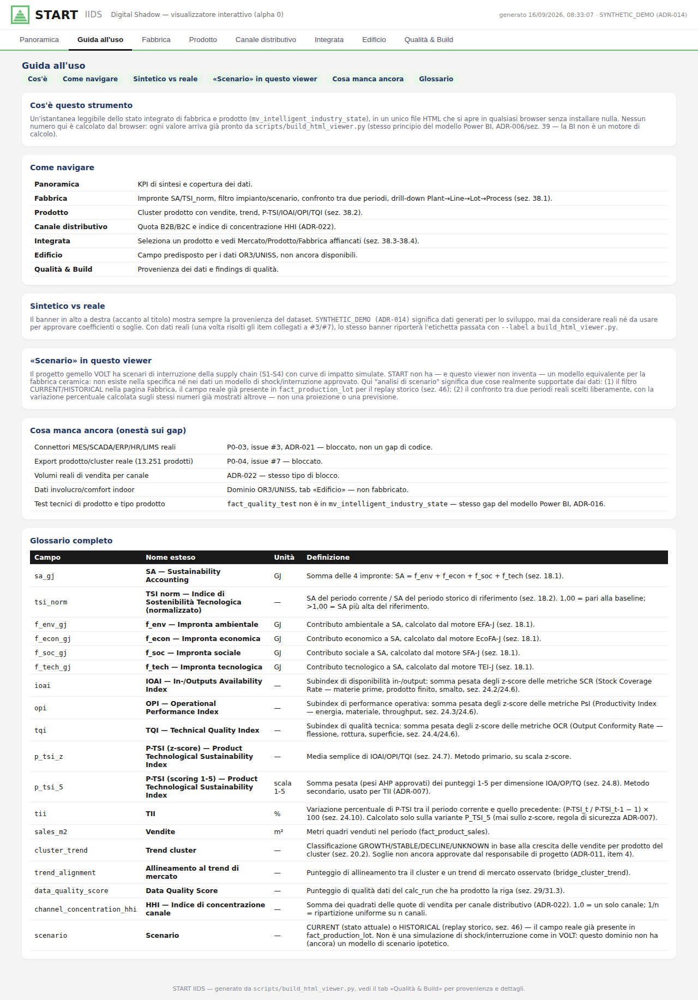

# START — Intelligent Industry Digital Shadow (IIDS)
## Guida all'architettura, alle finalità e allo stato del sistema

**Progetto:** START | SusTainable dAta-dRiven manufacTuring (DM 31 dicembre 2021, Accordi per l'Innovazione)
**Documento:** guida tecnico-narrativa al repository `start-iids`
**Versione:** 1.0 — 2026-09-16
**Responsabile di progetto:** Davide Settembre Blundo (Gresmalt, Innovation Program Manager)

---

## Sintesi esecutiva

`start-iids` è l'implementazione software del **Digital Shadow** della fabbrica
ceramica previsto dal progetto START: un flusso di dati a senso unico dal
sistema fisico (fabbrica, prodotto) al sistema digitale, mai il contrario —
niente automazione, niente scrittura verso gli impianti. Non tenta di
implementare l'intero Piano di Sviluppo del progetto (Allegato 4): copre in
modo mirato la parte di calcolo e dati di **OR6** e **OR7**, i due obiettivi
realizzativi di competenza di Gresmalt, lasciando fuori — correttamente — il
lavoro fisico/laboratorio degli altri quattro partner (UNIBZ, UNICAL, UNISS,
SACMI) e la parte organizzativa di OR8.

Lo stato al 2026-09-16: **27 dei 30 criteri di accettazione v1** della
specifica implementativa sono `DONE`; i restanti 3 sono `PARTIAL` per motivi
esterni documentati (non lacune di codice). **263 test automatici** passano,
copertura al 95% su `src/`. Ventiquattro Architecture Decision Record (ADR)
tracciano ogni scelta e ogni item aperto. Due modelli reali sono stati
validati contro dati reali pubblicati nei report di progetto (RP7.3, RP7.4) e
i relativi coefficienti sono stati **approvati formalmente** dal responsabile
di progetto. Un visualizzatore HTML autonomo (analogo a quello del progetto
gemello VOLT) rende lo stato del sistema consultabile senza alcun software
di BI installato.

Cinque punti restano bloccati, e lo sono per ragioni esterne verificate, non
per assenza di sviluppo: nomi reali dei campi IT (MES/SCADA/ERP/HR/LIMS),
l'export reale dei 13.251 prodotti con assegnazione cluster, i valori
approvati della libreria di coefficienti granulari, il collegamento a dati
edilizi reali (dominio di un altro partner), e un ambiente di staging reale
per la validazione finale. Ognuno è descritto in dettaglio nella sezione 6.

---

## Indice

1. Perché questo sistema: il problema e il mandato
2. Logica architetturale
3. Risposta alle finalità del Piano di Sviluppo (Allegato 4)
4. Il visualizzatore interattivo
5. Fonti utilizzate
6. Limiti attuali e cosa manca per il completamento
7. Governance, tracciabilità e come continuare il lavoro

Appendice A — Indice delle Architecture Decision Record
Appendice B — Glossario delle metriche

---

## 1. Perché questo sistema: il problema e il mandato

Il progetto START (Piano di Sviluppo, Allegato n. 4 al DM 31 dicembre 2021)
parte da una constatazione: l'industria manifatturiera italiana ha
digitalizzato con successo i propri processi nel quadro di Industria 4.0, ma
la trasformazione digitale non si esaurisce nella raccolta dei dati — richiede
di trasformarli in conoscenza utile alla riduzione dei costi e all'aumento
dell'efficienza. L'obiettivo finale dichiarato dal Piano è:

> "Progettare, realizzare e collaudare soluzioni tecnologiche e protocolli
> operativi, dalla fabbrica di ceramica all'applicazione costruttiva, per
> guidare la transizione della Smart Factory in Intelligent Factory,
> trasformando l'intera organizzazione da Industry 4.0 a Intelligent
> Industry in chiave di sostenibilità."

Il Piano struttura questo obiettivo in 8 Obiettivi Realizzativi (OR),
assegnati a 5 soggetti proponenti (Libera Università di Bolzano, Università
della Calabria, Università degli Studi di Sassari, SACMI, Gresmalt). `start-
iids` non copre l'intero Piano: implementa la parte **dati e calcolo** di
**OR6** ("Modellazione di soluzioni tecnologiche per la transizione verso la
Intelligent Industry") e **OR7** ("Validazione in ambiente operativo della
Intelligent Industry"), entrambi di responsabilità Gresmalt — vedi sezione 3
per la mappatura punto per punto.

Concretamente, il mandato tecnico di questo repository (specifica
implementativa "START Intelligent Industry Digital Shadow") è costruire un
**Digital Shadow**: un sistema che osserva lo stato della fabbrica e del
prodotto, calcola indicatori di sostenibilità tecnologica/ambientale/
economica/sociale su base scientifica tracciabile, e li rende disponibili
per l'analisi — senza mai chiudere il ciclo verso l'attuazione fisica (quello
sarebbe un Digital Twin, esplicitamente fuori perimetro, ADR-001).

---

## 2. Logica architetturale

### 2.1 Digital Shadow, non Digital Twin (ADR-001)

La distinzione è la prima decisione architetturale e vincola tutto il resto:
i dati fluiscono in un'unica direzione, dal sistema fisico al sistema
digitale. Nessun endpoint scrive verso PLC, MES o altri sistemi di
automazione. Questa regola è applicata sia strutturalmente (nessuna rotta di
scrittura nel codice) sia con una verifica automatica in CI che cerca pattern
di scrittura vietati.

### 2.2 Stratificazione dei dati (ADR-004)

Ogni dato attraversa 5 strati, mai saltati:

`raw_*` (append-only, immutabile) → `stg_*` (parsing/cast/naming) →
`dim_*`/`fact_*`/`bridge_*` (nucleo semantico) → `mart_*`/`mv_*` (output per
motori e BI) → `audit_*` (qualità, lineage, tracciabilità dei calcoli).

Nessun motore di calcolo legge direttamente da `raw_*`. Questa disciplina è
quella che ha permesso, ad esempio, di introdurre lo schema di staging per i
connettori Edge (issue #3) senza toccare un solo motore già esistente.

### 2.3 I motori di calcolo

Cinque motori, ciascuno con un'interfaccia comune (`CalculationEngine`),
versione tracciata (`engine_version`) e coefficienti governati:

- **TEI-J / EFA-J / EcoFA-J / SFA-J** — quattro motori per-lotto che
  calcolano rispettivamente l'impronta tecnologica, ambientale, economica e
  sociale di ogni lotto di produzione.
- **EEA+ (Extended Exergy Accounting)** — aggrega le quattro impronte in un
  indice termodinamico unico (`SA`, sez. 18.1) e nel suo rapporto alla
  baseline (`TSI_norm`, sez. 18.2). Esiste anche una variante aggregata
  plant/anno, validata su dati reali (sez. 3.3).
- **P-TSA (Product Technological Sustainability Assessment)** — calcola
  SCR/PsI/OCR a livello di prodotto, li normalizza in tre subindex
  (IOAI/OPI/TQI), e li combina in un indice di prodotto (P-TSI) con due
  varianti (z-score primaria, scoring 1-5 secondaria) e un indicatore di
  variazione periodo su periodo (TII).

Ogni calcolo è riproducibile (`audit_calc_run`) e mai sovrascritto in-place:
una nuova versione di un coefficiente o di un peso richiede un nuovo
`coefficient_set_id`/`weight_set_id`, mai una modifica di quello approvato
(sez. 11.3, Appendix M della specifica).

### 2.4 Ingestione dati a contratto (sez. 27, sez. 34)

Ogni sorgente esterna (MES, ERP, HR, SCADA, LIMS) è descritta da un
**contratto dati** dichiarativo (YAML): quali campi sorgente mappano su quali
campi target, quale campo compone la chiave di deduplica, quali regole
causano lo scarto di un record. Nessun motore di business codifica al suo
interno un mapping di campo — se cambia la sorgente, cambia solo il
contratto, non il motore. Su questa base sono stati costruiti un collector
Edge generico (acquisizione/validazione/filtro/deduplica) e uno scrittore
Cloud verso lo staging, entrambi utilizzabili con qualunque sorgente reale
non appena i nomi di campo reali saranno disponibili (sezione 6).

### 2.5 Qualità dati e audit (sez. 29, sez. 31.3)

Ogni record scartato produce un finding di qualità dati persistito, mai
perso silenziosamente. Le query di rilevamento delle violazioni "blocker"
sono state verificate contro inserimenti reali nel database di test, non
solo controllate come SQL sintatticamente valido — una distinzione che si è
rivelata concreta: prima di questa verifica, alcune regole non rilevavano
affatto le violazioni che dichiaravano di coprire.

### 2.6 Integrazione e visualizzazione (sez. 26, sez. 38-39)

Una vista integrata (`mv_intelligent_industry_state`) unisce fabbrica e
prodotto a grana lotto, alimentando sia un'API di sola lettura (FastAPI) sia
due deliverable di visualizzazione — un modello semantico Power BI e un
visualizzatore HTML autonomo (sezione 4). Regola non negoziabile per
entrambi: la visualizzazione non è mai un motore di calcolo (ADR-006) — ogni
numero mostrato è già stato calcolato a monte; il livello di presentazione fa
solo aggregazioni di visualizzazione (somma, media, massimo).

---

## 3. Risposta alle finalità del Piano di Sviluppo (Allegato 4)

Il Piano articola il progetto in 8 Obiettivi Realizzativi. La tabella che
segue mostra dove si colloca `start-iids` rispetto a ciascuno.

| OR | Titolo | Proponente | Relazione con questo repository |
|---|---|---|---|
| OR1 | Digital Twin / IA etica / data hub / chatbot | UNIBZ | Fuori perimetro — ricerca concettuale di un altro ente |
| OR2 | Modelli qualità materiali ceramici (NDT + ML) | UNICAL | Fuori perimetro — richiede campioni fisici e sensori NDT |
| OR3 | Involucro edilizio intelligente | UNISS | Fuori perimetro — dominio edificio, non fabbrica |
| OR4 | Framework AI per Intelligent Industry | SACMI | Fuori perimetro — framework su impianti SACMI reali |
| OR5 | Applicazione AI su impianto pilota | SACMI | Fuori perimetro — richiede impianto pilota reale |
| **OR6** | **Modellazione soluzioni tecnologiche** | **Gresmalt (Ricerca)** | **Nucleo di `start-iids`** |
| **OR7** | **Validazione in ambiente operativo** | **Gresmalt (Sviluppo)** | **Nucleo di `start-iids` per le parti dati/software** |
| OR8 | Misurazione risultati, coordinamento | Gresmalt | Fuori perimetro — project management |

### 3.1 OR6 — cosa implementa `start-iids`

| Task OR6 | Deliverable atteso dal Piano | Corrispondente nel repository | Stato |
|---|---|---|---|
| 6.1 Impronta tecnologica | TFA+ alpha | Motore TEI-J | Formula confermata sul manuale reale; coefficienti granulari ancora `DRAFT` |
| 6.2 Impronta ambientale | EFA+ alpha | Motore EFA-J | Formula confermata esatta |
| 6.3 Impronta sociale | SFA+ alpha | Motore SFA-J | Formula confermata esatta |
| 6.4 Impronta economica | EcoFA+ alpha | Motore EcoFA-J | Formula confermata esatta |
| 6.5 Modellazione termodinamica | EEA+ alpha | Aggregazione EEA+ | **Oltre l'alpha atteso**: validato su 66 dati reali RP7.3, coefficienti approvati |
| 6.6 Architettura Edge-to-Cloud | E2C alpha | Collector + staging Cloud | Infrastruttura generica pronta; connessione reale bloccata (P0-03) |
| 6.7 Progettazione Intelligent Factory | Architettura di implementazione | Stratificazione + vista integrata | Disegno pronto; integrazione MES/ERP reale in attesa dei dati |
| 6.8 Data-driven product analysis | Algoritmo k-means | Catalogo cluster SCD2 | Non lo stesso deliverable: qui i cluster sono importati, non calcolati (scelta di design, sez. 19.6) |
| 6.9 Data-driven product design | Protocollo Design Thinking | Workflow di design prodotto | Schema e macchina a stati pronti |
| 6.10 Modellazione Intelligent Industry | Integrazione BI | Vista integrata + modello Power BI + viewer HTML | Pronto a livello di modello |

### 3.2 OR7 — cosa implementa `start-iids`

| Task OR7 | Deliverable atteso dal Piano | Corrispondente nel repository | Stato |
|---|---|---|---|
| 7.1 UAT piattaforma E2C | Collaudo beta in produzione | Collector/writer testati su schema reale | Bloccato allo stesso punto del Piano (serve P0-03) |
| 7.2 Performance testing Intelligent Factory | Rollout riuscito | — | Fuori perimetro — serve infrastruttura reale |
| 7.3 Assessment termodinamico della fabbrica | Collaudo EEA+ beta su dati reali | Aggregato EEA+/TSI su 66 punti reali | **Obiettivo già raggiunto** |
| 7.4 Product Technological Sustainability Assessment | IOA/OP/TQ, P-TSI | Motore P-TSA | **Obiettivo raggiunto**, validato sui dati reali RP7.4 |
| 7.5 Data-Driven Product Quality Management | RFT/Defect Rate/IPR/Customer Rating | — | Non implementato: gap onestamente dichiarato |
| 7.6-7.9 | Adeguamento impianti, collaudo fisico, test preindustriale | — | Fuori perimetro — lavoro fisico su impianti |
| 7.8 Collaudo della Intelligent Industry | P-TSI + EEA+ su 6-12 mesi reali | — | Bloccato — è il traguardo che Stage 9 misura come non ancora raggiungibile |
| 7.10 Modello di business AI | Business Model Canvas | — | Fuori perimetro — analisi strategica |

### 3.3 Lettura d'insieme

Il Piano struttura il lavoro come una progressione OR6 (mesi 1-24, "alpha",
ricerca) → OR7 (mesi 13-36, "beta", validazione su dati reali). Tre
componenti di `start-iids` — l'aggregato EEA+/TSI, il motore P-TSA, e in
parte le formule granulari TEI/EFA/EcoFA/SFA — hanno già attraversato questa
progressione: dall'"alpha" (formula soltanto) a un livello equivalente a
"beta collaudata", grazie al reperimento e all'analisi dei report RP7.3 e
RP7.4 reali, con tanto di **approvazione formale del responsabile di
progetto** sui coefficienti — esattamente la governance richiesta dal Piano
(Appendix M della specifica implementativa).

Le componenti rimaste ad "alpha" condividono tutte la stessa causa: dipendono
da un input fisico reale che questo ambiente di sviluppo non possiede — un
impianto, un accesso IT, un export di terzi, un giudizio umano, o un processo
organizzativo. Nessuna è una lacuna di questo codice.

---

## 4. Il visualizzatore interattivo

Il modello semantico Power BI (`bi/powerbi/`) resta il deliverable
formalmente previsto (sez. 38-39 della specifica, OR6.10), ma le sue 3 pagine
report richiedono un passaggio di autoring in Power BI Desktop — un software
GUI con licenza che questo ambiente di sviluppo non può eseguire né
validare. Per non restare bloccati su questo, è stato costruito un
**visualizzatore HTML autonomo** (`bi/html_viewer/`), sullo stesso modello
già impiegato dal progetto gemello VOLT: un unico file HTML, senza
dipendenze esterne, generato da uno script Python
(`scripts/build_html_viewer.py`) a partire dagli stessi dati della vista
integrata.

Il viewer copre le stesse pagine previste dalla specifica per Power BI, più
due aggiunte pensate per il monitoraggio del rischio:

- **Panoramica** — KPI di sintesi e copertura dei dati.
- **Guida all'uso** — spiegazione della navigazione, provenienza dei dati, e
  glossario completo (vedi sotto).
- **Fabbrica** (sez. 38.1) — impronte SA/TSI_norm, drill-down
  Plant→Line→Lot→Process, un filtro CURRENT/HISTORICAL (il campo reale già
  presente nello schema per il replay storico, sez. 46) e un confronto tra
  due periodi a scelta.

- **Prodotto** (sez. 38.2) — cluster, vendite, trend, P-TSI/IOAI/OPI/TQI.
- **Canale distributivo** — un modulo aggiunto su richiesta diretta: quota
  di vendite B2B/B2C (lo split che il Piano di Sviluppo stesso nomina per
  Gresmalt, OR7.5) e un indice di concentrazione (Herfindahl-Hirschman),
  simmetrico al rischio di concentrazione fornitori che VOLT traccia a
  monte sulla filiera di approvvigionamento.

- **Integrata** (sez. 38.3-38.4) — selezione di un prodotto, con Mercato/
  Prodotto/Fabbrica affiancati.

- **Edificio** — un campo predisposto, non un dato fabbricato: elenca le
  attività reali di OR3 (involucro ventilato, comfort indoor, controllo
  predittivo, multiperformance) con nota esplicita che i dati non sono
  disponibili in questo repository, essendo dominio di un altro partner
  (UNISS).
- **Qualità & Build** — findings di qualità dati e provenienza della build
  (dataset sintetico o reale), così che nessuno scambi un output di sviluppo
  per un dato reale.

Ogni metrica mostrata (SA, TSI_norm, IOAI/OPI/TQI, P-TSI, TII, HHI...) ha un
nome esteso e una spiegazione al passaggio del mouse, tratti da un glossario
unico radicato nella specifica e nei motori — mai un'sigla non spiegata.

**Importante — cosa il viewer non è.** Il progetto gemello VOLT simula
scenari di interruzione della catena di approvvigionamento (S1-S4) con curve
di impatto. Questo dominio non ha, e questo viewer non inventa, un modello
equivalente per la fabbrica ceramica: non esiste nella specifica né nei dati
un modello di shock/interruzione approvato. L'"analisi di scenario" qui
disponibile — filtro CURRENT/HISTORICAL e confronto tra periodi reali — è
deliberatamente più limitata, ma reale al 100%.

**Uso pratico.** `python3 -m scripts.build_html_viewer --out dist/viewer.html`
genera il file contro il dataset sintetico (ADR-014); con `--db-url` e
`--label` genera lo stesso file contro un database reale, senza alcuna
modifica al template.

---

## 5. Fonti utilizzate

Ogni scelta tecnica di questo repository è tracciabile a una fonte precisa —
mai una formula o un coefficiente inventato per far tornare un risultato
(sez. 64 della specifica). Le fonti principali:

| Fonte | Uso in questo repository |
|---|---|
| *START Intelligent Industry Digital Shadow — Implementation Spec v1.0* | Specifica implementativa di riferimento per l'intera architettura (stratificazione, motori, criteri di accettazione, sez. 1-65) |
| *START_Piano_di_Sviluppo_all4_integrato.pdf* (Allegato 4) | Obiettivi realizzativi, obiettivo finale del progetto, mappatura di scopo (sezione 3 di questa guida) |
| Manuali operativi Modulo TEI-J / EFA-J / EcoFA-J / SFA-J (beta) per EEA+ | Verifica e correzione delle formule dei 4 motori per-lotto (ADR-018) |
| *RP7.3 Report di Assessment termodinamico della fabbrica* + `RP7.3_calculation_log.xlsx` | Modello aggregato EEA+/TSI reale, validato su 66 punti dati (ADR-012, ADR-019) |
| *RP 7.4 Report di Product Technological Sustainability Assessment* | Dataset reale per la golden regression P-TSA z-score/scoring (ADR-020) |
| *RP6.8 Report di Product Analysis* | I 22 cluster prodotto reali caricati (ADR-015) |
| *RP6.6/RP6.7 Report di progettazione* + *RP 7.1/RP 7.2 (collaudo/performance)* | Verifica diretta che i nomi reali di campo IT non sono presenti in questo corpus (ADR-021) |
| Dataset sintetico `SYNTHETIC_DEMO` (generato in repository) | Sviluppo e test del modello Power BI e del visualizzatore HTML prima che i dati reali fossero disponibili — mai usato per approvare coefficienti (ADR-014) |

Tutte le fonti reali citate sono documenti del corpus di progetto (report
RP, manuali operativi), non fonti esterne o inventate. Ogni volta che un
dato non era reperibile in questo corpus, questo è stato dichiarato
esplicitamente invece di essere approssimato (vedi sezione 6).

---

## 6. Limiti attuali e cosa manca per il completamento

Cinque blocchi, tutti di natura esterna — nessuno richiede ulteriore
sviluppo software:

1. **Nomi reali di campi/tabelle IT** (MES/SCADA/ERP/HR/LIMS) — verificato
   assente da RP6.6/RP6.7/RP 7.1/RP 7.2 (letti integralmente). Da richiedere
   ai referenti IT dei sistemi di stabilimento. All'arrivo: si sostituiscono
   i placeholder `TBD_*` nei contratti dati già pronti, nessuna modifica di
   schema o codice motore.
2. **Export reale dei 13.251 prodotti con assegnazione cluster** (RP6.8 sez.
   3.7) — da richiedere a chi detiene i deliverable grezzi. All'arrivo:
   importazione diretta con lo script già pronto e validato.
3. **Valori approvati della libreria di coefficienti granulari** ("Tabella
   2", citata da tutti e 4 i manuali operativi) — le *formule* sono già
   confermate; mancano i *valori* e la firma di approvazione del
   responsabile di progetto.
4. **Dati reali di involucro/comfort indoor** — dominio di OR3 (UNISS), un
   partner diverso; il tab "Edificio" del viewer resta un campo predisposto.
5. **Un ambiente di staging reale** per eseguire la validazione finale
   (Stage 9, sez. 65) con dati reali, oltre a quanto già verificabile in
   questo repository.

Un gap più piccolo, dichiarato onestamente: i 4 KPI di qualità prodotto di
OR7.5 (Right First Time, Defect Rate, Inspection Pass Rate, Customer Rating)
non sono ancora implementati — non richiedono un dato esterno, ma un
incremento di sviluppo quando saranno disponibili dati reali di scelta/
reclamo. Analogamente per il tab "Canale distributivo" del viewer: la
struttura è pronta, mancano i volumi di vendita reali per canale.

Un documento operativo dedicato (`docs/EXTERNAL_INPUT_REQUEST.md`) elenca
questi punti con il destinatario esatto della richiesta e cosa scatta
automaticamente all'arrivo dell'input.

---

## 7. Governance, tracciabilità e come continuare il lavoro

- **24 Architecture Decision Record** (`docs/decisions/ADR-001` …
  `ADR-024`) tracciano ogni decisione architetturale, ogni item aperto e
  ogni sua risoluzione (Appendice A).
- **263 test automatici** (unit, integration, regression), 95% di copertura
  su `src/`, CI verde.
- **`docs/ROADMAP.md`** riporta lo stato dettagliato stage per stage e
  criterio per criterio della specifica (sez. 53, sez. 57), aggiornato ad
  ogni incremento.
- **`scripts/stage9_validation_checklist.py`** esegue una checklist
  ripetibile (non un'affermazione mantenuta a mano) contro i 21 item di
  validazione finale della specifica (sez. 65).

Per chi continua questo lavoro: la sezione "Next steps" di `docs/ROADMAP.md`
è la lista operativa aggiornata, in ordine di dipendenza. Il documento
`docs/EXTERNAL_INPUT_REQUEST.md` è la stessa lista, riformulata come
richiesta diretta a chi detiene ciascun input mancante.

---

## Appendice A — Indice delle Architecture Decision Record

| ADR | Titolo | Stato |
|---|---|---|
| 001 | Digital Shadow, nessuna attuazione | Approvato |
| 002 | Architettura dual-domain: Factory Shadow + Product Shadow | Approvato |
| 003 | Il lotto come ponte centrale | Proposto (ARCH) |
| 004 | Stratificazione Raw → Staging → Core → Mart → Audit | Proposto (ARCH) |
| 005 | MJ interno, GJ in output (correzione P0 obbligatoria) | Applicato |
| 006 | La BI non è un motore di calcolo | Proposto (ARCH) |
| 007 | TII calcolato solo sulla variante scoring/AHP di P-TSI | Applicato (regola di sicurezza) |
| 008 | Clustering prodotto, vendite collegate ex post | Documentato |
| 009 | ARIMA / ottimizzatore di portafoglio / modello logistico disattivati | Documentato/futuro |
| 010 | DALY solo diagnostico | Documentato |
| 011 | Item di formula aperti in attesa di conferma | Parzialmente superato (item 1-3 da ADR-018, item 5 da ADR-020) |
| 012 | Modello aggregato reale RP7.3 | Documentato, verificato numericamente |
| 013 | Coefficienti e pesi RP7.3 promossi ad APPROVED | Approvato, 2026-09-01 |
| 014 | Dataset sintetico temporaneo per lo sviluppo Power BI | Approvato dal responsabile di progetto |
| 015 | Import master data RP6.8: cosa è reale e caricabile ora | Accettato |
| 016 | Modello semantico Power BI: formato e perimetro | Accettato |
| 017 | Validazione Stage 9: cosa un repository da solo può e non può chiudere | Accettato |
| 018 | Manuali SRC-TEI/EFA/EcoFA/SFA trovati; penalità qualità TEI-J corretta | Accettato |
| 019 | Psi/Ex_useful risolti tramite il report RP7.3 primario | Accettato |
| 020 | Report RP7.4 trovato; golden regression z-score P-TSA sbloccata | Accettato |
| 021 | Infrastruttura connettori E2C costruita; P0-03 confermato blocco esterno | Accettato |
| 022 | Dimensione canale distributivo | Accettato |
| 023 | Visualizzatore HTML autonomo come deliverable BI "alpha 0" | Accettato |
| 024 | Visualizzatore HTML: interattività, glossario, scenario reale, branding | Accettato |

---

## Appendice B — Glossario delle metriche

| Campo | Nome esteso | Definizione |
|---|---|---|
| SA | Sustainability Accounting | Somma delle 4 impronte: SA = f_env + f_econ + f_soc + f_tech (sez. 18.1) |
| TSI_norm | Indice di Sostenibilità Tecnologica (normalizzato) | SA del periodo corrente / SA del periodo storico di riferimento (sez. 18.2) |
| f_env | Impronta ambientale | Contributo ambientale a SA, motore EFA-J |
| f_econ | Impronta economica | Contributo economico a SA, motore EcoFA-J |
| f_soc | Impronta sociale | Contributo sociale a SA, motore SFA-J |
| f_tech | Impronta tecnologica | Contributo tecnologico a SA, motore TEI-J |
| IOAI | In-/Outputs Availability Index | Subindex di disponibilità in-/output, da metriche SCR (sez. 24.2/24.6) |
| OPI | Operational Performance Index | Subindex di performance operativa, da metriche PsI (sez. 24.3/24.6) |
| TQI | Technical Quality Index | Subindex di qualità tecnica, da metriche OCR (sez. 24.4/24.6) |
| P-TSI (z-score) | Product Technological Sustainability Index | Media semplice di IOAI/OPI/TQI (sez. 24.7) |
| P-TSI (scoring 1-5) | Product Technological Sustainability Index | Somma pesata (pesi AHP approvati) dei punteggi 1-5 (sez. 24.8) |
| TII | — (non espanso nella specifica) | Variazione percentuale di P-TSI tra periodo corrente e precedente (sez. 24.10) |
| HHI | Indice di concentrazione canale | Somma dei quadrati delle quote di vendita per canale distributivo (ADR-022) |
| Scenario | CURRENT / HISTORICAL | Stato attuale o replay storico (sez. 46) — mai un valore ipotetico |
