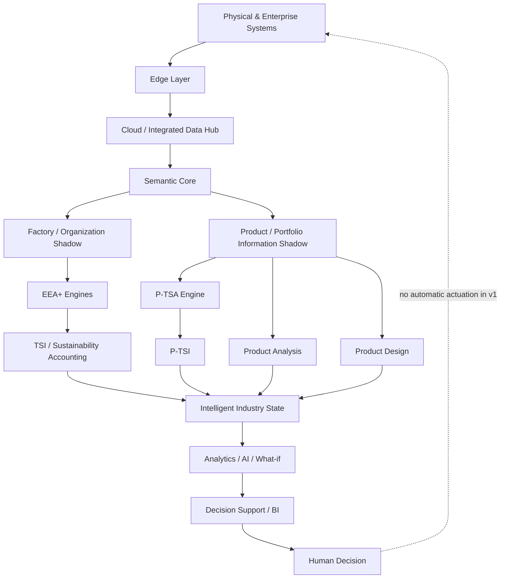
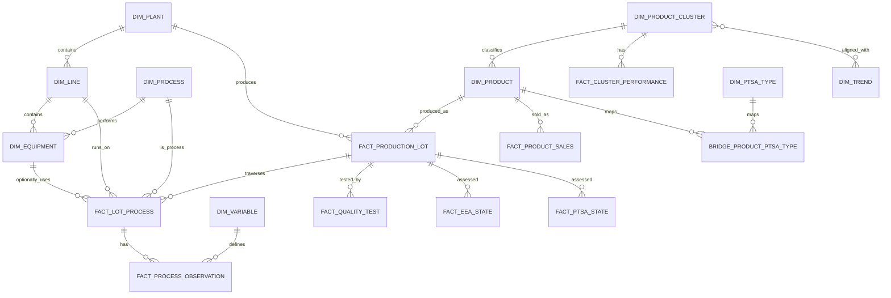
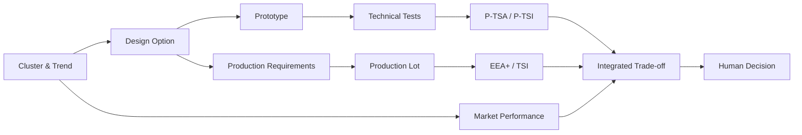
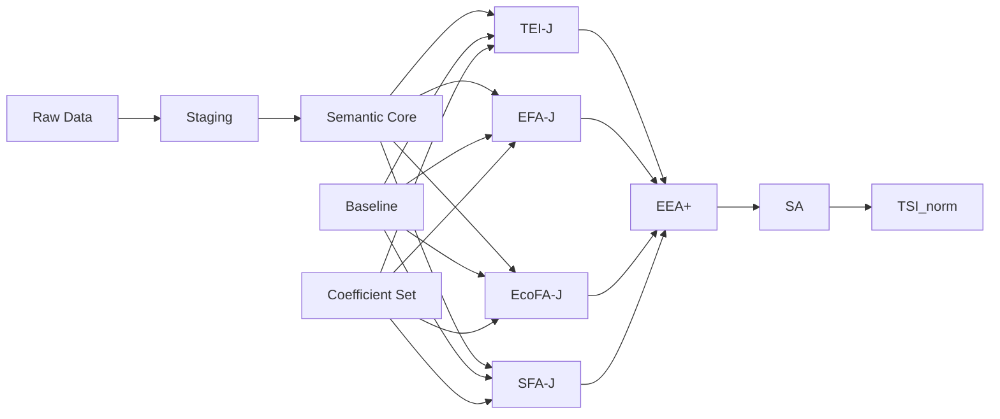
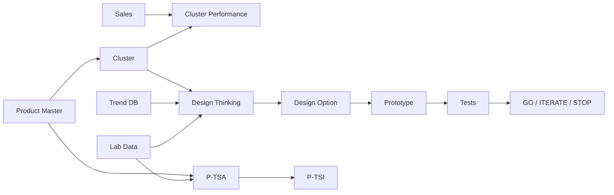
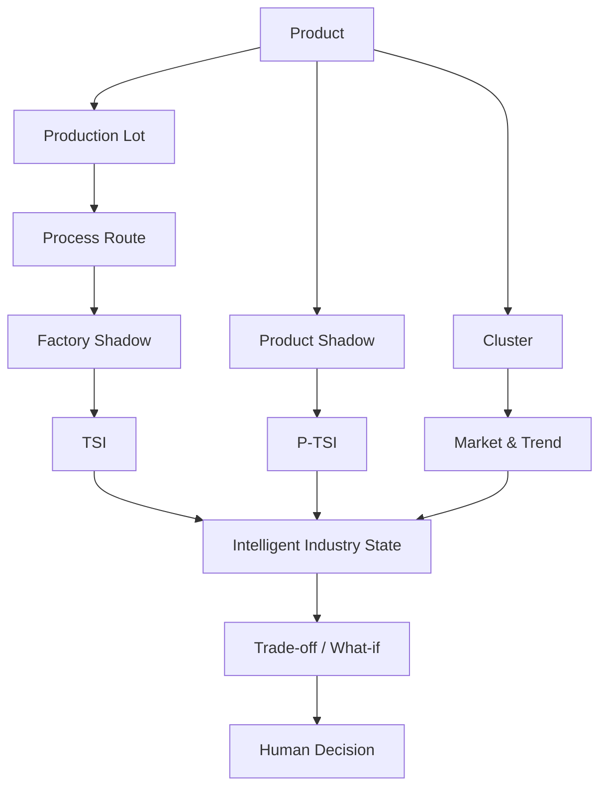

# START Intelligent Industry Digital Shadow Architecture
## Specifica tecnica e guida di implementazione per agenti AI
### Versione 1.0 — 31 agosto 2026

**Progetto:** START — *SusTainable dAta-dRiven manufacTuring*  
**Accordo Innovazione:** DM 31/12/2021 — Prog. n. F/310087/01-05/X56  
**Scopo del documento:** tradurre i risultati progettuali START e l'architettura integrativa definita a valle dei deliverable in una specifica sufficientemente dettagliata da consentire a più agenti software autonomi di implementare il **Digital Shadow della Intelligent Industry** senza dover reinterpretare autonomamente requisiti, formule, relazioni dati o confini funzionali.

---

# 0. Come usare questo documento

Questo documento deve essere trattato come **specifica di implementazione**, non come testo divulgativo.

Gli agenti che lavorano sul progetto DEVONO:

1. rispettare definizioni, nomi canonici e vincoli indicati;
2. non introdurre logiche di calcolo alternative senza decisione esplicita del responsabile di progetto;
3. distinguere sempre tra:
   - **DOC** = elemento direttamente supportato dai documenti START;
   - **ARCH** = scelta architetturale introdotta per rendere operativa l'integrazione tra risultati START;
   - **FUTURE** = funzione prevista o coerente con sviluppi successivi, ma **non da attivare nella release v1**;
4. considerare il modello un **Digital Shadow** e non un Digital Twin:
   - flusso automatico **Physical → Digital**;
   - analisi, previsione, simulazione e raccomandazione ammesse;
   - **nessuna attuazione automatica sul sistema fisico** nella v1;
5. preservare la tracciabilità:
   - ogni dato deve avere una sorgente;
   - ogni coefficiente deve avere una versione;
   - ogni calcolo deve avere un `calc_run_id`;
   - ogni risultato deve essere riproducibile;
6. non usare valori segnaposto dei manuali come coefficienti di produzione;
7. non implementare ARIMA, regressione logistica di successo del concept, ottimizzatore automatico di portfolio o controllo chiuso verso PLC nella v1, salvo successiva istruzione esplicita.

---

# 1. Corpus progettuale di riferimento

La specifica è costruita sui seguenti documenti START.

| ID sorgente | Documento | Ruolo nella specifica |
|---|---|---|
| `SRC-PLAN` | `START_Piano_di_Sviluppo_all4_integrato.pdf` | Obiettivi, OR, Digital Shadow/Twin, ontologia, Data Hub, OR6.10, KPI |
| `SRC-RP66` | `RP6.6 Report di progettazione dell'Architettura Edge to Cloud_30-09-24.pdf` | Architettura E2C, Edge/Cloud, flussi, latency/load test |
| `SRC-RP73` | `RP7.3 Report di Assessment termodinamico della fabbrica_300425.docx` | EEA+ operativo, doppia sorgente ERP/E2C, TSI, Digital Grey Shadow, quattro moduli -J |
| `SRC-TEI` | `Manuale operativo – Modulo TEI-J (beta) per EEA+.pdf` | Impronta tecnologica in Joule, MTS/MTO, tabelle e formule |
| `SRC-EFA` | `Manuale operativo – Modulo EFA-J (beta) per EEA+.pdf` | Impronta ambientale in Joule |
| `SRC-ECO` | `Manuale operativo – Modulo EcoFA-J (beta) per EEA+.pdf` | Impronta economica in Joule |
| `SRC-SFA` | `Manuale operativo – Modulo SFA-J (beta) per EEA+.pdf` | Impronta sociale in Joule |
| `SRC-RP68` | `RP6.8 Report di Product Analysis_30-04-25.pdf` | Product master, K-Prototypes, 22 cluster, CQS, vendite ex-post |
| `SRC-RP69` | `RP6.9 Report di Data-driven Product Design _30-04-25.pdf` | Gemello informativo del portafoglio, trend, Design Thinking, portfolio model alpha |
| `SRC-RP69A` | `RP6.9 Annesso_Protocollo di Product Design_30-04-25.pdf` | Workflow operativo e tracciabilità del design |
| `SRC-RP74` | `RP 7.4 Report di Product Technological Sustainability Assessment.pdf` | P-TSA, SCR/PsI/OCR, P-TSI, AHP, TII |
| `SRC-SYMNX` | `Paper - Thermoeconomics meets business science.pdf` | Fondazione sistemica/termoeconomica e integrazione business-science |

## 1.1 Regola di interpretazione delle fonti

Quando una scelta è presente direttamente nelle fonti, questa specifica la recepisce come **DOC**.

Quando le fonti forniscono componenti ma non definiscono il modo preciso di integrarli, la specifica introduce una scelta **ARCH**. Esempi:

- `lot_id` come cerniera tra dominio prodotto e dominio fabbrica → **ARCH**;
- tabella `FACT_LOT_PROCESS` → **ARCH**;
- Digital Shadow come stato ricostruibile tramite query temporale e non come singola tabella → **ARCH**;
- separazione `raw`, `staging`, `core`, `mart`, `audit` → **ARCH**;
- calcolo EEA+/P-TSA derivato dalle formule dei manuali → **DOC**;
- ARIMA operativo → **FUTURE**, perché in RP6.9 è solo prospettico.

---

# 2. Obiettivo del sistema

## 2.1 Definizione funzionale

Il sistema da implementare è lo:

> **START Intelligent Industry Digital Shadow (IIDS)**

Definizione operativa:

> rappresentazione digitale dinamica, semanticamente integrata e temporalmente sincronizzata dello stato della Intelligent Industry, alimentata automaticamente dal sistema fisico e dai sistemi gestionali, capace di rappresentare processi, risorse, prestazioni, prodotto, portafoglio, mercato e sostenibilità multidimensionale, e di supportare analisi descrittive, diagnostiche, predittive e di scenario senza attuazione automatica sul sistema fisico.

Questa formulazione è una **ARCH** costruita integrando:

- Digital Shadow/Digital Grey Shadow del dominio fabbrica;
- E2C;
- EEA+/TSI;
- Product Analysis;
- Product Design;
- P-TSA/P-TSI;
- obiettivo integrativo OR6.10.

## 2.2 Dual-domain architecture

Il modello è composto da due domini digitali accoppiati.

### Dominio A — Factory / Organization Shadow

Rappresenta:

- stabilimento;
- linea;
- processo;
- equipment;
- lotto;
- flussi di materia;
- energia;
- acqua;
- scarti;
- qualità;
- dati economici;
- dati sociali;
- impronta tecnologica;
- EEA+;
- TSI.

Formalmente:

\[
DS_F(t) = [P_t, R_t, Q_t, E_t, Env_t, Eco_t, Soc_t, Tech_t]
\]

La formula è **ARCH**, mentre le dimensioni derivano dai moduli e dalle attività START.

### Dominio B — Product / Portfolio Information Shadow

Rappresenta:

- prodotto;
- attributi;
- cluster;
- vendite;
- trend;
- performance di portfolio;
- progetto di design;
- opzioni;
- prototipi;
- prove;
- P-TSA;
- P-TSI.

Formalmente:

\[
DS_P(t) = [C_t, D_t, T_t, Perf_t, Config_t, Lab_t, PTSA_t]
\]

Anche questa formula è **ARCH**, costruita sulla base di OR6.8, OR6.9 e OR7.4.

### Stato complessivo

\[
IIDS(t) = [DS_F(t), DS_P(t), TSI(t), P\text{-}TSI(t), K(t)]
\]

dove `K(t)` rappresenta il livello di conoscenza derivato da analytics/AI.

**IMPORTANTE:** `IIDS(t)` è una rappresentazione concettuale. Non deve essere implementata come un'unica tabella sorgente. Deve essere ricostruibile tramite viste/materialized views.

---

# 3. Confine Digital Shadow vs Digital Twin

## 3.1 Regola non negoziabile della release v1

La v1 DEVE rispettare:

\[
Physical \rightarrow Digital
\]

e NON deve implementare:

\[
Digital \rightarrow Automatic\ Physical\ Actuation
\]

Sono ammessi:

- lettura dati da PLC/SCADA/MES;
- elaborazione Edge;
- trasferimento Edge→Cloud;
- aggiornamento di modelli analitici Cloud→Edge;
- anomaly detection;
- prediction;
- what-if;
- simulazione;
- raccomandazione;
- supporto alla decisione umana.

Non sono ammessi:

- endpoint di scrittura set-point;
- scrittura automatica su PLC;
- comandi automatici verso linea;
- chiusura autonoma dell'anello di controllo.

Il passaggio al Digital Twin bidirezionale è **FUTURE**.

## 3.2 Vincolo software

La codebase v1 NON deve contenere endpoint funzionali equivalenti a:

```text
/plc/write
/actuate
/setpoint/apply
/command/execute
```

Se si predispone un'interfaccia futura, deve essere:

- disabilitata;
- non deployata;
- protetta da feature flag `ENABLE_ACTUATION=false`;
- documentata come FUTURE.

---

# 4. Architettura logica complessiva



---

# 5. Architettura fisica di riferimento

La specifica è logicamente tool-agnostica. Per evitare ambiguità agli agenti, si assume come **reference implementation ARCH**:

- **Edge:** collector/container locale read-only verso OT;
- **Cloud/Data Hub:** Azure-compatible;
- **Object storage:** Data Lake / parquet;
- **Relational analytical core:** PostgreSQL-compatible SQL come DDL di riferimento oppure Azure SQL;
- **ETL/ELT:** Python 3.12 + SQL;
- **Computation engines:** Python;
- **BI:** Power BI / SAP BusinessObjects;
- **API opzionale:** FastAPI/read-only;
- **Version control:** Git;
- **CI/CD:** pipeline con unit test + data contract validation.

Il codice non deve dipendere rigidamente da PostgreSQL se l'ambiente finale sarà Azure SQL; il DDL di questo documento è il **contratto logico**.

---

# 6. Layering dati

Tutti i dati DEVONO attraversare cinque layer.

## 6.1 RAW

Scopo: conservare il dato sorgente senza modifiche semantiche.

Regole:

- append-only;
- immutabile;
- mantenere payload originale;
- mantenere sorgente;
- mantenere `source_ts`;
- mantenere `ingestion_ts`;
- nessuna conversione distruttiva;
- nessuna correzione manuale inline.

Naming:

```text
raw_<source>_<entity>
```

Esempi:

```text
raw_mes_production
raw_scada_energy
raw_erp_sales
raw_hr_metrics
raw_lims_quality
```

## 6.2 STAGING

Scopo:

- parsing;
- type casting;
- naming canonico;
- normalizzazione tecnica;
- deduplica;
- unit tagging;
- validazione di struttura.

Naming:

```text
stg_<domain>_<entity>
```

## 6.3 CORE

Scopo:

- entità semantiche;
- PK/FK;
- mapping product/lot/process;
- master data;
- osservazioni canoniche.

Naming:

```text
dim_*
fact_*
bridge_*
```

## 6.4 MART

Scopo:

- EEA+;
- P-TSA;
- stato Intelligent Industry;
- BI.

Naming:

```text
mart_*
mv_*
```

## 6.5 AUDIT

Scopo:

- data quality;
- coefficient version;
- calc runs;
- lineage;
- errori;
- riconciliazione.

Naming:

```text
audit_*
```

---

# 7. Convenzioni obbligatorie

## 7.1 Timestamp

- Storage canonico: UTC.
- Visualizzazione BI: Europe/Rome.
- Ogni record temporale deve distinguere:
  - `source_ts`;
  - `ingestion_ts`.
- Se il sorgente non ha timezone, il mapping deve dichiarare la timezone assunta.

## 7.2 Unità

### P0 — correzione tecnica obbligatoria

I manuali -J contengono una incoerenza: diversi esempi etichettano i valori intermedi come `MJ` ma convertono in GJ dividendo per `1e9`.

La release v1 DEVE congelare questa convenzione:

### Raw

Unità originali:

- kg
- t
- kWh
- Nm³
- m³
- €
- h
- pz
- m²
- N
- N/mm²
- ecc.

### Computational canonical energy unit

\[
\boxed{MJ}
\]

### Reporting unit

\[
\boxed{GJ}
\]

Conversione:

\[
1\,GJ = 1000\,MJ
\]

quindi:

```python
gj = mj / 1000.0
```

e NON:

```python
gj = mj / 1e9
```

Il divisore `1e9` è corretto solo per J→GJ.

Tutti i test devono verificare esplicitamente questo punto.

## 7.3 Valute

- EcoFA/SFA economico: prezzi costanti all'anno base.
- Importi nominali NON devono essere convertiti direttamente in Joule.
- Deve esistere un `deflator_version`.

## 7.4 Decimali

Usare `DECIMAL/NUMERIC` per:

- quantità contabili;
- coefficienti;
- valori di sostenibilità;
- pesi AHP.

Floating point è ammesso nei motori Python ma il risultato persistito deve essere normalizzato.

---

# 8. Chiavi semantiche

La cerniera centrale del modello è il **lotto**.

\[
Product \leftrightarrow Lot \leftrightarrow Process \leftrightarrow Factory
\]

## 8.1 Chiavi canoniche

- `plant_id`
- `line_id`
- `process_id`
- `equipment_id`
- `product_id`
- `cluster_id`
- `product_type_id`
- `lot_id`
- `design_project_id`
- `design_option_id`
- `prototype_id`
- `coefficient_set_id`
- `baseline_id`
- `calc_run_id`

## 8.2 Regola lot_id

`lot_id` deve:

- essere univoco almeno a livello di gruppo;
- essere stabile;
- non dipendere da timestamp per l'identità;
- essere mappabile al codice lotto MES;
- essere associabile a un solo `product_id` nella v1.

Se un lotto contiene più prodotti, introdurre `bridge_lot_product`; NON sovraccaricare `product_id`.

---

# 9. Entity Relationship Model — Core



---

# 10. DDL di riferimento

Il seguente DDL è **reference SQL**. Gli agenti possono tradurre i tipi a Azure SQL, ma NON cambiare semantica, PK/FK o vincoli senza documentazione.

## 10.1 DIM_PLANT

```sql
CREATE TABLE dim_plant (
    plant_id            VARCHAR(32) PRIMARY KEY,
    plant_name          VARCHAR(255) NOT NULL,
    site_code           VARCHAR(64) UNIQUE,
    active_from         DATE,
    active_to           DATE,
    is_active           BOOLEAN NOT NULL DEFAULT TRUE,
    created_at          TIMESTAMP NOT NULL DEFAULT CURRENT_TIMESTAMP,
    updated_at          TIMESTAMP NOT NULL DEFAULT CURRENT_TIMESTAMP
);
```

## 10.2 DIM_LINE

```sql
CREATE TABLE dim_line (
    line_id             VARCHAR(64) PRIMARY KEY,
    plant_id            VARCHAR(32) NOT NULL REFERENCES dim_plant(plant_id),
    line_name           VARCHAR(255) NOT NULL,
    area_type           VARCHAR(16),
    active_from         DATE,
    active_to           DATE,
    is_active           BOOLEAN NOT NULL DEFAULT TRUE,
    CHECK (area_type IN ('MTS','MTO','OTHER') OR area_type IS NULL)
);
```

## 10.3 DIM_PROCESS

```sql
CREATE TABLE dim_process (
    process_id          VARCHAR(64) PRIMARY KEY,
    process_name        VARCHAR(255) NOT NULL,
    process_family      VARCHAR(64) NOT NULL,
    mts_mto_class       VARCHAR(16),
    sequence_group      VARCHAR(64),
    CHECK (mts_mto_class IN ('MTS','MTO','OTHER') OR mts_mto_class IS NULL)
);
```

Valori `process_family` iniziali raccomandati:

```text
RAW_MATERIAL_HANDLING
MILLING
SPRAY_DRYING
PRESSING
DRYING
GLAZING_DECORATION
KILN_FIRING
FINISHING
SORTING_PACKAGING
WAREHOUSE
```

L'elenco è ARCH e deve essere mappato ai processi reali.

## 10.4 DIM_EQUIPMENT

```sql
CREATE TABLE dim_equipment (
    equipment_id        VARCHAR(64) PRIMARY KEY,
    line_id             VARCHAR(64) NOT NULL REFERENCES dim_line(line_id),
    process_id          VARCHAR(64) REFERENCES dim_process(process_id),
    equipment_name      VARCHAR(255),
    asset_class         VARCHAR(128),
    source_asset_code   VARCHAR(128),
    active_from         DATE,
    active_to           DATE,
    is_active           BOOLEAN NOT NULL DEFAULT TRUE
);
```

## 10.5 DIM_PRODUCT_CLUSTER

```sql
CREATE TABLE dim_product_cluster (
    cluster_id                  INTEGER NOT NULL,
    cluster_version             VARCHAR(64) NOT NULL,
    dominant_shape              VARCHAR(128),
    dominant_dimension          VARCHAR(128),
    dominant_thickness          VARCHAR(128),
    dominant_slip_class         VARCHAR(128),
    dominant_effect             VARCHAR(128),
    dominant_colour             VARCHAR(128),
    balance_score               NUMERIC(12,8),
    coherence_score             NUMERIC(12,8),
    separation_score            NUMERIC(12,8),
    business_relevance_score    NUMERIC(12,8),
    cqs                         NUMERIC(12,8),
    valid_from                  DATE,
    valid_to                    DATE,
    is_current                  BOOLEAN NOT NULL DEFAULT TRUE,
    PRIMARY KEY (cluster_id, cluster_version)
);
```

La versione iniziale deve caricare i 22 cluster documentati in OR6.8.

## 10.6 DIM_PRODUCT

```sql
CREATE TABLE dim_product (
    product_id              VARCHAR(128) PRIMARY KEY,
    product_name            VARCHAR(255),
    cluster_id              INTEGER,
    cluster_version         VARCHAR(64),
    shape                   VARCHAR(128),
    dimension_class         VARCHAR(64),
    format_mm               VARCHAR(64),
    thickness_mm            NUMERIC(12,4),
    slip_class              VARCHAR(64),
    surface_effect          VARCHAR(128),
    finish                  VARCHAR(128),
    colour_class            VARCHAR(128),
    mass_kg_m2              NUMERIC(14,6),
    product_status          VARCHAR(32),
    source_product_code     VARCHAR(128),
    valid_from              DATE,
    valid_to                DATE,
    is_current              BOOLEAN NOT NULL DEFAULT TRUE,
    FOREIGN KEY (cluster_id, cluster_version)
        REFERENCES dim_product_cluster(cluster_id, cluster_version)
);
```

### Regola importante

La performance commerciale NON entra nella classificazione cluster. OR6.8 costruisce il clustering sugli attributi intrinseci e collega le vendite **ex post**.

## 10.7 DIM_PTSA_TYPE

```sql
CREATE TABLE dim_ptsa_type (
    product_type_id         VARCHAR(64) PRIMARY KEY,
    description             VARCHAR(255),
    thickness_mm            NUMERIC(12,4),
    mass_kg_m2              NUMERIC(14,6),
    declared_unit           VARCHAR(64),
    epd_reference           VARCHAR(255),
    default_plant_id        VARCHAR(32) REFERENCES dim_plant(plant_id),
    valid_from              DATE,
    valid_to                DATE
);
```

Caricamento iniziale:

```text
T1 = 7.4 mm
T2 = 8.2 mm
T3 = 20.0 mm
```

## 10.8 BRIDGE_PRODUCT_PTSA_TYPE

```sql
CREATE TABLE bridge_product_ptsa_type (
    product_id          VARCHAR(128) NOT NULL REFERENCES dim_product(product_id),
    product_type_id     VARCHAR(64) NOT NULL REFERENCES dim_ptsa_type(product_type_id),
    valid_from          DATE NOT NULL,
    valid_to            DATE,
    mapping_method      VARCHAR(64),
    mapping_confidence  VARCHAR(8),
    PRIMARY KEY (product_id, product_type_id, valid_from)
);
```

## 10.9 FACT_PRODUCTION_LOT

```sql
CREATE TABLE fact_production_lot (
    lot_id              VARCHAR(128) PRIMARY KEY,
    product_id          VARCHAR(128) NOT NULL REFERENCES dim_product(product_id),
    plant_id            VARCHAR(32) NOT NULL REFERENCES dim_plant(plant_id),
    start_ts            TIMESTAMP NOT NULL,
    end_ts              TIMESTAMP,
    output_m2           NUMERIC(18,6),
    output_pcs          NUMERIC(18,3),
    output_kg           NUMERIC(18,6),
    quality_grade       VARCHAR(64),
    scenario            VARCHAR(16) NOT NULL,
    source_lot_code     VARCHAR(128),
    source_system       VARCHAR(64),
    ingestion_ts        TIMESTAMP NOT NULL DEFAULT CURRENT_TIMESTAMP,
    CHECK (scenario IN ('HISTORICAL','CURRENT'))
);
```

## 10.10 FACT_LOT_PROCESS

```sql
CREATE TABLE fact_lot_process (
    lot_process_id      BIGINT PRIMARY KEY,
    lot_id              VARCHAR(128) NOT NULL REFERENCES fact_production_lot(lot_id),
    process_id          VARCHAR(64) NOT NULL REFERENCES dim_process(process_id),
    line_id             VARCHAR(64) NOT NULL REFERENCES dim_line(line_id),
    equipment_id        VARCHAR(64) REFERENCES dim_equipment(equipment_id),
    sequence_no         INTEGER NOT NULL,
    start_ts            TIMESTAMP NOT NULL,
    end_ts              TIMESTAMP,
    input_qty           NUMERIC(18,6),
    output_qty          NUMERIC(18,6),
    qty_unit            VARCHAR(32),
    source_system       VARCHAR(64),
    UNIQUE (lot_id, sequence_no)
);
```

## 10.11 DIM_VARIABLE

```sql
CREATE TABLE dim_variable (
    variable_code       VARCHAR(128) PRIMARY KEY,
    description         VARCHAR(255) NOT NULL,
    domain              VARCHAR(32) NOT NULL,
    canonical_unit      VARCHAR(32),
    aggregation_rule    VARCHAR(16),
    expected_min        NUMERIC(24,8),
    expected_max        NUMERIC(24,8),
    accounting_owner    VARCHAR(16),
    is_active           BOOLEAN NOT NULL DEFAULT TRUE,
    CHECK (aggregation_rule IN ('SUM','AVG','MIN','MAX','LAST','NONE')),
    CHECK (accounting_owner IN ('EFA','ECOFA','SFA','TEI','PTSA','DIAGNOSTIC') OR accounting_owner IS NULL)
);
```

`accounting_owner` NON significa che il dato grezzo non possa essere letto da più motori. Significa che la voce contabile equivalente non deve essere duplicata.

## 10.12 FACT_PROCESS_OBSERVATION

```sql
CREATE TABLE fact_process_observation (
    observation_id      BIGINT PRIMARY KEY,
    lot_process_id      BIGINT REFERENCES fact_lot_process(lot_process_id),
    equipment_id        VARCHAR(64) REFERENCES dim_equipment(equipment_id),
    variable_code       VARCHAR(128) NOT NULL REFERENCES dim_variable(variable_code),
    source_ts           TIMESTAMP NOT NULL,
    ingestion_ts        TIMESTAMP NOT NULL DEFAULT CURRENT_TIMESTAMP,
    value_num           NUMERIC(28,10),
    value_text          VARCHAR(512),
    original_unit       VARCHAR(32),
    canonical_value     NUMERIC(28,10),
    canonical_unit      VARCHAR(32),
    source_system       VARCHAR(64) NOT NULL,
    quality_flag        VARCHAR(32) NOT NULL DEFAULT 'VALID',
    confidence          VARCHAR(8),
    UNIQUE (source_system, variable_code, source_ts, equipment_id, lot_process_id)
);
```

## 10.13 FACT_QUALITY_TEST

```sql
CREATE TABLE fact_quality_test (
    quality_test_id         BIGINT PRIMARY KEY,
    lot_id                  VARCHAR(128) REFERENCES fact_production_lot(lot_id),
    prototype_id            VARCHAR(128),
    test_code               VARCHAR(128) NOT NULL,
    measured_value          NUMERIC(24,8),
    measured_text           VARCHAR(512),
    unit                    VARCHAR(32),
    acceptance_threshold    NUMERIC(24,8),
    threshold_operator      VARCHAR(8),
    pass_flag               BOOLEAN,
    test_ts                 TIMESTAMP NOT NULL,
    source_system           VARCHAR(64),
    method_reference        VARCHAR(255)
);
```

---

# 11. Registro coefficienti

## 11.1 DIM_COEFFICIENT_SET

```sql
CREATE TABLE dim_coefficient_set (
    coefficient_set_id      VARCHAR(64) PRIMARY KEY,
    description             VARCHAR(255),
    reference_year          INTEGER,
    status                  VARCHAR(16) NOT NULL,
    approved_by             VARCHAR(255),
    approved_at             TIMESTAMP,
    CHECK (status IN ('DRAFT','APPROVED','RETIRED'))
);
```

## 11.2 DIM_COEFFICIENT

```sql
CREATE TABLE dim_coefficient (
    coefficient_id          VARCHAR(128) NOT NULL,
    coefficient_set_id      VARCHAR(64) NOT NULL REFERENCES dim_coefficient_set(coefficient_set_id),
    domain                  VARCHAR(16) NOT NULL,
    code                    VARCHAR(128) NOT NULL,
    description             VARCHAR(255),
    coefficient_value       NUMERIC(28,12) NOT NULL,
    coefficient_unit        VARCHAR(64) NOT NULL,
    source                  VARCHAR(512),
    source_year             INTEGER,
    boundary                VARCHAR(32),
    method                  VARCHAR(32),
    confidence              VARCHAR(8),
    valid_from              DATE,
    valid_to                DATE,
    PRIMARY KEY (coefficient_id, coefficient_set_id),
    CHECK (domain IN ('EFA','ECOFA','SFA','TEI','PTSA'))
);
```

## 11.3 Regole

1. Nessun coefficiente di produzione può essere `NULL`.
2. I coefficienti segnaposto dei manuali NON devono essere caricati come `APPROVED`.
3. Baseline e current devono usare lo stesso `coefficient_set_id`.
4. Ogni modifica crea una nuova versione; NON aggiornare retroattivamente un set approvato.
5. La confidenza deve usare A/B/C.
6. Conservare fonte, anno, perimetro, metodo, confidenza.

---

# 12. Baseline management

RP7.3 assume riferimento fisso 2017 per il confronto Smart Factory vs Intelligent Factory.

## 12.1 DIM_BASELINE

```sql
CREATE TABLE dim_baseline (
    baseline_id                 VARCHAR(64) PRIMARY KEY,
    baseline_name               VARCHAR(255) NOT NULL,
    baseline_year               INTEGER NOT NULL,
    plant_id                    VARCHAR(32) REFERENCES dim_plant(plant_id),
    functional_unit             VARCHAR(64) NOT NULL,
    coefficient_set_id          VARCHAR(64) NOT NULL REFERENCES dim_coefficient_set(coefficient_set_id),
    start_date                  DATE,
    end_date                    DATE,
    status                      VARCHAR(16) NOT NULL,
    notes                       TEXT,
    CHECK (status IN ('DRAFT','APPROVED','RETIRED'))
);
```

## 12.2 Regole baseline

Per un confronto valido:

- stessa unità funzionale;
- stessa finestra coerente;
- stesso set coefficienti;
- stesso perimetro;
- stessa logica di allocazione;
- eventuali dati mancanti devono avere flag.

---

# 13. Calculation run & auditability

Ogni calcolo EEA+ o P-TSA deve essere un oggetto versionato.

## 13.1 AUDIT_CALC_RUN

```sql
CREATE TABLE audit_calc_run (
    calc_run_id              VARCHAR(128) PRIMARY KEY,
    engine                   VARCHAR(32) NOT NULL,
    engine_version           VARCHAR(64) NOT NULL,
    code_commit              VARCHAR(64),
    baseline_id              VARCHAR(64) REFERENCES dim_baseline(baseline_id),
    coefficient_set_id       VARCHAR(64) REFERENCES dim_coefficient_set(coefficient_set_id),
    weight_set_id            VARCHAR(64),
    period_start             TIMESTAMP NOT NULL,
    period_end               TIMESTAMP NOT NULL,
    scenario                 VARCHAR(16),
    status                   VARCHAR(16) NOT NULL,
    started_at               TIMESTAMP NOT NULL,
    completed_at             TIMESTAMP,
    input_record_count       BIGINT,
    rejected_record_count    BIGINT,
    data_quality_score       NUMERIC(12,8),
    error_message            TEXT,
    CHECK (engine IN ('EFA','ECOFA','SFA','TEI','EEA','PTSA','PRODUCT_CLUSTER')),
    CHECK (status IN ('RUNNING','SUCCESS','FAILED','REJECTED'))
);
```

## 13.2 Regola di riproducibilità

Un risultato è valido solo se è possibile ricostruire:

```text
result
→ calc_run_id
→ engine_version
→ git commit
→ input window
→ baseline
→ coefficient set
→ weight set
→ data quality
```

---

# 14. Motore TEI-J

Fonte: manuale TEI-J.

## 14.1 Perimetro MTS

MTS = push, area spray-dryer/preparazione corpo.

Dati minimi:

```text
m_RM
m_UW
m_SDM
E_SD_kWh
T_prod_h
```

## 14.2 Perimetro MTO

MTO = pull, forming + kiln + finishing.

Dati minimi:

```text
m_SDU
N_T_man
N_T_sold
E_form_kWh
E_kiln_Nm3
T_prod_h
```

## 14.3 Conversioni base

\[
Ex_x = q_x b_x
\]

Elettricità:

\[
Ex_{el}[MJ] = kWh \times 3.6
\]

Gas:

\[
Ex_{gas}[MJ] = Nm^3 \times PCI \times f_{ex}
\]

## 14.4 MTS loss

\[
Ex^{MTS}_{loss} = (Ex_{RM} + Ex_{UW} + Ex_{E,SD}) - Ex_{SDM}
\]

## 14.5 MTO loss

\[
Ex^{MTO}_{loss} = (Ex_{SDM} + Ex_{E,form} + Ex_{E,kiln}) - Ex_T
\]

## 14.6 Backlog

\[
Ex_{inv} = \left(1-\frac{N_{sold}}{N_{man}}\right) Ex_T
\]

Protezione:

- se `N_man = 0` → run rejected per quel gruppo;
- se `N_sold > N_man` nello stesso periodo → flag `TEMPORAL_MISMATCH`, non clamp automatico.

## 14.7 Penalità qualità

Applicare la formula del manuale utilizzando:

- `q`;
- `q_thr`;
- `kappa`.

`kappa` deve provenire da coefficiente approvato.

## 14.8 Contributo tecnologico

\[
f_{tech} =
(Ex_{loss,base}^{MTS} + Ex_{loss,base}^{MTO})
-
(Ex_{loss}^{MTS} + Ex_{loss}^{MTO})
-
Ex_{inv}
-
Ex_{qual}^{MTS}
-
Ex_{qual}^{MTO}
\]

Persistenza interna in MJ, reporting in GJ.

---

# 15. Motore EFA-J

Fonte: manuale EFA-J.

## 15.1 Dataset logici

- Env_Flows
- Env_Waste
- Env_Impacts
- Env_Recovery
- Baseline
- Coefficients

## 15.2 Resource Intake

\[
RI = Ex_{mat} + Ex_{el} + Ex_{fuel} + Ex_{H2O}
\]

dove:

\[
Ex_{mat} = \sum_i m_i b_i
\]

\[
Ex_{el} = kWh \times 3.6
\]

\[
Ex_{fuel} = V_{fuel} b_{fuel}
\]

\[
Ex_{H2O} = W b_{H2O}
\]

## 15.3 Waste Exergy

\[
WEX = \sum_k R_k b_{w,k}
\]

Riciclo interno:

- cut-off;
- `b=0` a monte;
- conteggiare solo energia di rilavoro.

## 15.4 Impact Equivalent

\[
IEQ = \sum_j Em_j \gamma_j
\]

## 15.5 Circularity Credit

\[
CIRC = Ex_{rec,mat} + Ex_{rec,th}
\]

## 15.6 f_env

\[
f_{env} =
(RI_{base} - RI)
+
(CIRC - CIRC_{base})
-
(IEQ - IEQ_{base})
-
(WEX - WEX_{base})
\]

## 15.7 Anti-double-counting

Un recupero NON può:

- ridurre RI;
- e contemporaneamente entrare come CIRC sulla stessa voce.

Implementare controllo a livello di `accounting_term_id`.

---

# 16. Motore EcoFA-J

## 16.1 Include

- servizi esterni;
- manutenzioni conto terzi;
- smaltimenti esterni se non già fisici;
- logistica economica solo se manca driver fisico;
- consulenze tecniche;
- licenze/software;
- valore aggiunto;
- immobilizzi economici.

## 16.2 Esclude

- materiali già EFA/TEI;
- energia;
- acqua;
- rifiuti fisici già EFA;
- lavoro umano già SFA;
- IVA;
- imposte;
- oneri finanziari.

## 16.3 Input economico

\[
Ex_{econ,in} = \sum_c C_c \gamma_c
\]

## 16.4 Valore aggiunto

\[
Ex_{VA} = VA \gamma_{VA}
\]

## 16.5 Immobilizzi

\[
Ex_{INV} = INV \gamma_{INV}
\]

## 16.6 f_econ

\[
f_{econ} =
(Ex_{VA}-Ex_{VA,base})
-
(Ex_{econ,in}-Ex_{econ,in,base})
-
(Ex_{INV}-Ex_{INV,base})
\]

## 16.7 Priorità driver fisico

Se esiste t·km:

- usare EFA-J;
- NON usare €→MJ in EcoFA per la stessa attività.

---

# 17. Motore SFA-J

## 17.1 Perimetro

- stakeholder value;
- salute/sicurezza;
- continuità occupazionale;
- ore perse;
- formazione;
- turnover/onboarding opzionale.

## 17.2 Stakeholder value

\[
Ex_{SV} = \sum_{stk} V_{stk} \gamma_{€}
\]

## 17.3 CO2 equivalente sociale in Joule

\[
Ex_{CO2} = Em_{CO2} \gamma_{CO2}^{MJ}
\]

## 17.4 DALY

\[
DALY = Em_{CO2} \gamma_{CO2}^{DALY}
\]

### Regola

DALY è **diagnostico**.

NON entra in `f_soc` finché non viene approvato un mapping `DALY → J`.

## 17.5 Ore perse

\[
Ex_{lost} = H_{lost} b_{L,h}
\]

## 17.6 Credito formazione

\[
Ex_{train,cred} = \rho_{train} H_{train} b_{L,h}
\]

## 17.7 f_soc

\[
f_{soc} =
(Ex_{SV}-Ex_{SV,base})
+
(Ex_{train}-Ex_{train,base})
-
(Ex_{lost}-Ex_{lost,base})
-
(Ex_{CO2}-Ex_{CO2,base})
\]

## 17.8 Privacy

Il MART sociale non deve contenere:

- nomi;
- matricole;
- dati sanitari individuali.

Aggregare a plant/line se consentito/periodo.

---

# 18. Motore EEA+ e TSI

## 18.1 Sustainability Accounting

\[
SA = f_{env} + f_{econ} + f_{soc} + f_{tech}
\]

Tutti i termini devono essere in GJ.

## 18.2 TSI normalizzato documentato in RP7.3

\[
TSI_{norm} = \frac{SA_{current}}{SA_{historical}}
\]

## 18.3 Persistenza

```sql
CREATE TABLE fact_eea_state (
    eea_state_id           BIGINT PRIMARY KEY,
    calc_run_id            VARCHAR(128) NOT NULL REFERENCES audit_calc_run(calc_run_id),
    plant_id               VARCHAR(32) NOT NULL REFERENCES dim_plant(plant_id),
    line_id                VARCHAR(64) REFERENCES dim_line(line_id),
    lot_id                 VARCHAR(128) REFERENCES fact_production_lot(lot_id),
    period_start           TIMESTAMP NOT NULL,
    period_end             TIMESTAMP NOT NULL,
    scenario               VARCHAR(16) NOT NULL,
    f_env_mj               NUMERIC(28,8),
    f_econ_mj              NUMERIC(28,8),
    f_soc_mj               NUMERIC(28,8),
    f_tech_mj              NUMERIC(28,8),
    sa_mj                  NUMERIC(28,8),
    f_env_gj               NUMERIC(28,8),
    f_econ_gj              NUMERIC(28,8),
    f_soc_gj               NUMERIC(28,8),
    f_tech_gj              NUMERIC(28,8),
    sa_gj                  NUMERIC(28,8),
    tsi_norm               NUMERIC(28,10),
    data_quality_score     NUMERIC(12,8)
);
```

## 18.4 Regola ratio

`tsi_norm` può essere calcolato solo se:

- baseline disponibile;
- `SA_historical != 0`;
- stesso perimetro;
- stessa FU;
- stesso coefficient set.

Altrimenti:

- `tsi_norm = NULL`;
- quality flag = `NON_COMPARABLE`.

---

# 19. Product Analysis — OR6.8

## 19.1 Dataset iniziale

- 13.251 prodotti finiti;
- attributi estetici, strutturali, prestazionali;
- vendite 2017–2024.

## 19.2 Regola di clustering

Il clustering usa gli attributi prodotto.

NON usa i volumi di vendita durante la partizione.

## 19.3 Algoritmo documentato

K-Prototypes.

Variabili ordinali mappate numericamente e standardizzate.

Variabili nominali mantenute categoriali.

## 19.4 Configurazione documentata

- `k` esplorato: 10–25;
- fase esplorativa `n_init=15`;
- finale `n_init=50`;
- `max_iter=100`;
- `random_state=42`;
- inizializzazioni Cao/Huang;
- soluzione selezionata: 22 cluster.

## 19.5 CQS

\[
CQS = 0.15 Balance + 0.35 Coherence + 0.25 Separation + 0.25 BusinessRelevance
\]

Risultato documentato:

```text
Balance = 0.811
Coherence = 0.721
Separation = 0.623
Business Relevance = 1.000
CQS = 0.780
```

## 19.6 Release v1

NON è necessario rilanciare automaticamente il clustering ogni giorno.

Regola consigliata:

- importare cluster esistenti;
- versionare `cluster_version`;
- ricalcolo annuale o su richiesta;
- nuova versione cluster NON sovrascrive quella storica.

---

# 20. Sales & Cluster Performance

## 20.1 FACT_PRODUCT_SALES

```sql
CREATE TABLE fact_product_sales (
    product_sales_id       BIGINT PRIMARY KEY,
    product_id             VARCHAR(128) NOT NULL REFERENCES dim_product(product_id),
    period_start           DATE NOT NULL,
    period_end             DATE NOT NULL,
    market_id              VARCHAR(64),
    sales_m2               NUMERIC(20,6),
    revenue_eur            NUMERIC(20,4),
    source_system          VARCHAR(64),
    ingestion_ts           TIMESTAMP NOT NULL DEFAULT CURRENT_TIMESTAMP
);
```

## 20.2 FACT_CLUSTER_PERFORMANCE

```sql
CREATE TABLE fact_cluster_performance (
    cluster_perf_id        BIGINT PRIMARY KEY,
    cluster_id             INTEGER NOT NULL,
    cluster_version        VARCHAR(64) NOT NULL,
    period_start           DATE NOT NULL,
    period_end             DATE NOT NULL,
    product_count          INTEGER,
    sales_total_m2         NUMERIC(20,6),
    sales_m2_per_product   NUMERIC(20,6),
    trend_class            VARCHAR(16),
    FOREIGN KEY (cluster_id, cluster_version)
      REFERENCES dim_product_cluster(cluster_id, cluster_version),
    CHECK (trend_class IN ('GROWTH','STABLE','DECLINE','UNKNOWN'))
);
```

---

# 21. Trend Intelligence

## 21.1 Tre livelli

1. Historical trend 2017–2024;
2. Contemporary Observatory;
3. Scenario/prefiguration.

ARIMA = FUTURE.

## 21.2 DIM_TREND

```sql
CREATE TABLE dim_trend (
    trend_id              VARCHAR(128) PRIMARY KEY,
    trend_category        VARCHAR(64) NOT NULL,
    trend_value           VARCHAR(255) NOT NULL,
    source_type           VARCHAR(32) NOT NULL,
    source_name           VARCHAR(255),
    period_start          DATE,
    period_end            DATE,
    signal_strength       NUMERIC(12,8),
    analyst_note          TEXT,
    source_reference      VARCHAR(512),
    CHECK (source_type IN ('HISTORICAL','CONTEMPORARY','SCENARIO','FORECAST'))
);
```

`FORECAST` deve rimanere disattivato nella v1 se implica modello ARIMA non ancora validato.

## 21.3 BRIDGE_CLUSTER_TREND

```sql
CREATE TABLE bridge_cluster_trend (
    cluster_id          INTEGER NOT NULL,
    cluster_version     VARCHAR(64) NOT NULL,
    trend_id            VARCHAR(128) NOT NULL REFERENCES dim_trend(trend_id),
    alignment_score     NUMERIC(12,8),
    evidence_note       TEXT,
    PRIMARY KEY (cluster_id, cluster_version, trend_id),
    FOREIGN KEY (cluster_id, cluster_version)
      REFERENCES dim_product_cluster(cluster_id, cluster_version)
);
```

---

# 22. Product Design workflow

## 22.1 Fasi canoniche

A. Avvio e brief  
B. Lettura coordinata dei dati  
C. Sintesi in chiave ceramica  
D. Ideazione e prototipazione  
E. Valutazione e decisione  
F. Chiusura e trasferimento

## 22.2 FACT_DESIGN_PROJECT

```sql
CREATE TABLE fact_design_project (
    design_project_id        VARCHAR(128) PRIMARY KEY,
    project_name             VARCHAR(255) NOT NULL,
    brief_date               DATE,
    use_destination          VARCHAR(64),
    target_market            VARCHAR(255),
    positioning              TEXT,
    production_constraints   TEXT,
    timeline_notes           TEXT,
    project_status           VARCHAR(32) NOT NULL,
    coordinator              VARCHAR(255),
    created_at               TIMESTAMP NOT NULL DEFAULT CURRENT_TIMESTAMP
);
```

## 22.3 FACT_DESIGN_OPTION

```sql
CREATE TABLE fact_design_option (
    design_option_id          VARCHAR(128) PRIMARY KEY,
    design_project_id         VARCHAR(128) NOT NULL REFERENCES fact_design_project(design_project_id),
    option_code               VARCHAR(32),
    reference_cluster_id      INTEGER,
    reference_cluster_version VARCHAR(64),
    format_mm                 VARCHAR(64),
    thickness_mm              NUMERIC(12,4),
    slip_class                VARCHAR(64),
    surface_effect            VARCHAR(128),
    colour_palette            VARCHAR(512),
    data_rationale            TEXT,
    created_at                TIMESTAMP NOT NULL DEFAULT CURRENT_TIMESTAMP,
    FOREIGN KEY (reference_cluster_id, reference_cluster_version)
       REFERENCES dim_product_cluster(cluster_id, cluster_version)
);
```

## 22.4 FACT_PROTOTYPE

```sql
CREATE TABLE fact_prototype (
    prototype_id             VARCHAR(128) PRIMARY KEY,
    design_option_id         VARCHAR(128) NOT NULL REFERENCES fact_design_option(design_option_id),
    prototype_version        INTEGER NOT NULL,
    body_colourant           VARCHAR(255),
    pad                      VARCHAR(255),
    glaze                    VARCHAR(255),
    granules                 VARCHAR(255),
    surface_application      VARCHAR(512),
    graphic_file_reference   VARCHAR(512),
    firing_curve_reference   VARCHAR(512),
    created_at               TIMESTAMP NOT NULL DEFAULT CURRENT_TIMESTAMP,
    UNIQUE (design_option_id, prototype_version)
);
```

## 22.5 FACT_DESIGN_DECISION

```sql
CREATE TABLE fact_design_decision (
    decision_id              BIGINT PRIMARY KEY,
    design_option_id         VARCHAR(128) NOT NULL REFERENCES fact_design_option(design_option_id),
    decision_ts              TIMESTAMP NOT NULL,
    technical_status         VARCHAR(32),
    trend_alignment          NUMERIC(12,8),
    target_alignment         NUMERIC(12,8),
    decision_code            VARCHAR(32) NOT NULL,
    decision_reason          TEXT NOT NULL,
    decided_by               VARCHAR(255),
    CHECK (decision_code IN ('GO','ITERATE','STOP','HOLD_QUEUE','NEXT_CYCLE'))
);
```

## 22.6 Event log

Per audit, ogni cambio fase deve produrre:

```text
design_project_id
stage
event_ts
actor
input_reference
output_reference
notes
```

---

# 23. Design ↔ Process Requirements

Questa è una delle principali estensioni **ARCH**.

Scopo: formalizzare il passaggio:

\[
Product\ Design \rightarrow Production\ Requirements
\]

## 23.1 BRIDGE_DESIGN_PROCESS_REQUIREMENT

```sql
CREATE TABLE bridge_design_process_requirement (
    design_option_id       VARCHAR(128) NOT NULL REFERENCES fact_design_option(design_option_id),
    process_id             VARCHAR(64) NOT NULL REFERENCES dim_process(process_id),
    requirement_code       VARCHAR(128) NOT NULL,
    required_value_num     NUMERIC(24,8),
    required_value_text    VARCHAR(255),
    unit                   VARCHAR(32),
    tolerance_min          NUMERIC(24,8),
    tolerance_max          NUMERIC(24,8),
    source                 VARCHAR(255),
    PRIMARY KEY (design_option_id, process_id, requirement_code)
);
```

Esempi:

```text
THICKNESS_TARGET
FORMAT_CAPABILITY
SLIP_CLASS_TARGET
GLAZE_ROUTE
FIRING_CURVE
SURFACE_PROCESS
```

---

# 24. P-TSA Engine

## 24.1 Categorie

- IOA — In-/Outputs Availability
- OP — Operational Performance
- TQ — Technical Quality

## 24.2 SCR

\[
SCR = \frac{Stock}{DailyConsumption}
\]

Input documentati:

- materie prime;
- prodotto finito;
- smalti/engobbi/inchiostri.

## 24.3 PsI

\[
PsI = \frac{RealOutput}{RealInput}
\]

Metriche:

- produttività energetica [m²/GJ];
- resa materiale [m²/m²];
- throughput [m²/h].

## 24.4 OCR

\[
OCR = \frac{QP}{AT}
\]

Parametri documentati:

- resistenza a flessione;
- sforzo di rottura;
- qualità superficiale.

## 24.5 Normalizzazione primaria

Per indicatore `k` e tipologia `a`:

\[
z_{k,a} = \frac{x_{k,a}-\bar{x}_k}{\sigma_k}
\]

## 24.6 Subindex

\[
IOAI = \sum_k w_k z_k
\]

\[
OPI = \sum_k w_k z_k
\]

\[
TQI = \sum_k w_k z_k
\]

Caso base: pesi uguali intra-dimensione.

## 24.7 P-TSI primario

\[
P\text{-}TSI_z = \frac{1}{3}IOAI + \frac{1}{3}OPI + \frac{1}{3}TQI
\]

## 24.8 Metodo secondario

Scoring 1–5 + AHP.

Pesi documentati RP7.4:

```text
alpha_IOA = 0.1634
alpha_OP  = 0.2970
alpha_TQ  = 0.5396
CR = 0.0079
```

NON hardcodare nel codice. Creare un weight set versionato.

## 24.9 Weight tables

```sql
CREATE TABLE dim_weight_set (
    weight_set_id         VARCHAR(64) PRIMARY KEY,
    methodology           VARCHAR(64),
    version               VARCHAR(32),
    status                VARCHAR(16),
    consistency_ratio     NUMERIC(12,8),
    approved_by           VARCHAR(255),
    approved_at           TIMESTAMP
);

CREATE TABLE dim_weight (
    weight_set_id         VARCHAR(64) NOT NULL REFERENCES dim_weight_set(weight_set_id),
    dimension_code        VARCHAR(64) NOT NULL,
    metric_code           VARCHAR(64),
    weight_value          NUMERIC(18,12) NOT NULL,
    PRIMARY KEY (weight_set_id, dimension_code, metric_code)
);
```

## 24.10 TII

\[
TII_{t-1,t} = \left(\frac{P\text{-}TSI_t}{P\text{-}TSI_{t-1}} - 1\right)100
\]

### Implementazione sicura

Di default calcolare TII su `P_TSI_5`, perché:

- è positivo;
- è ratio-compatible.

NON calcolare automaticamente TII sul P-TSI z-score se il denominatore può essere zero o negativo.

Memorizzare:

```text
tii_base_variant = P_TSI_5
```

---

# 25. FACT_PTSA_STATE

```sql
CREATE TABLE fact_ptsa_state (
    ptsa_state_id            BIGINT PRIMARY KEY,
    calc_run_id              VARCHAR(128) NOT NULL REFERENCES audit_calc_run(calc_run_id),
    period_start             TIMESTAMP NOT NULL,
    period_end               TIMESTAMP NOT NULL,
    product_type_id          VARCHAR(64) REFERENCES dim_ptsa_type(product_type_id),
    product_id               VARCHAR(128) REFERENCES dim_product(product_id),
    lot_id                   VARCHAR(128) REFERENCES fact_production_lot(lot_id),
    plant_id                 VARCHAR(32) REFERENCES dim_plant(plant_id),

    scr_raw_material         NUMERIC(20,8),
    scr_finished_product     NUMERIC(20,8),
    scr_glaze                NUMERIC(20,8),

    psi_energy               NUMERIC(20,8),
    psi_material             NUMERIC(20,8),
    psi_throughput           NUMERIC(20,8),

    ocr_flexural             NUMERIC(20,8),
    ocr_breaking_load        NUMERIC(20,8),
    ocr_surface              NUMERIC(20,8),

    ioai                     NUMERIC(20,8),
    opi                      NUMERIC(20,8),
    tqi                      NUMERIC(20,8),

    p_tsi_z                  NUMERIC(20,8),
    p_tsi_5                  NUMERIC(20,8),
    tii                      NUMERIC(20,8),

    weight_set_id            VARCHAR(64) REFERENCES dim_weight_set(weight_set_id),
    data_quality_score       NUMERIC(12,8)
);
```

---

# 26. Intelligent Industry materialized view

Il Digital Shadow non è una tabella singola. Tuttavia, per BI e API è utile una vista materializzata.

## 26.1 Grain

Grain preferenziale:

```text
period + plant + lot + product
```

Quando dati sociali/economici non arrivano a lotto, applicare allocazione documentata o lasciare `NULL`. NON inventare granularità.

## 26.2 MV_INTELLIGENT_INDUSTRY_STATE

Campi minimi:

```text
period_start
period_end
plant_id
line_id
lot_id
product_id
cluster_id
cluster_version

f_env_gj
f_econ_gj
f_soc_gj
f_tech_gj
sa_gj
tsi_norm

ioai
opi
tqi
p_tsi_z
p_tsi_5
tii

sales_m2
cluster_trend
trend_alignment

design_project_id
design_option_id
design_decision

data_quality_score
coefficient_set_id
weight_set_id
baseline_id
calc_run_id
```

---

# 27. Data contracts

Ogni sorgente deve avere un contratto YAML.

Esempio:

```yaml
contract_id: MES_PRODUCTION_V1
source_system: MES
entity: production_lot
owner: production_it

keys:
  - lot_code
  - product_code

timestamp:
  field: start_time
  timezone: Europe/Rome

fields:
  lot_code:
    target: lot_id
    type: string
    required: true

  product_code:
    target: product_id
    type: string
    required: true

  output_m2:
    target: output_m2
    type: decimal
    unit: m2
    min: 0

quality:
  reject_if_missing:
    - lot_code
    - product_code
    - start_time

deduplication:
  key:
    - lot_code
    - product_code
    - start_time
```

Nessun agente deve codificare mapping direttamente dentro il business engine.

---

# 28. Source mapping registry

```sql
CREATE TABLE audit_source_mapping (
    source_system        VARCHAR(64) NOT NULL,
    source_field         VARCHAR(128) NOT NULL,
    target_entity        VARCHAR(128) NOT NULL,
    target_field         VARCHAR(128) NOT NULL,
    transformation_rule  TEXT,
    unit_rule            VARCHAR(255),
    valid_from           DATE NOT NULL,
    valid_to             DATE,
    approved_by          VARCHAR(255),
    PRIMARY KEY (source_system, source_field, target_entity, valid_from)
);
```

Scopo:

- rendere auditabile la semantica;
- evitare mapping invisibili nel codice.

---

# 29. Data quality

## 29.1 Dimensioni

Ogni dataset deve essere valutato almeno per:

1. completeness;
2. validity;
3. consistency;
4. uniqueness;
5. timeliness;
6. unit coherence;
7. referential integrity;
8. baseline compatibility;
9. coefficient availability.

## 29.2 AUDIT_DATA_QUALITY

```sql
CREATE TABLE audit_data_quality (
    dq_id                   BIGINT PRIMARY KEY,
    dataset_name            VARCHAR(128) NOT NULL,
    record_key              VARCHAR(512),
    check_code              VARCHAR(128) NOT NULL,
    severity                VARCHAR(16) NOT NULL,
    passed                  BOOLEAN NOT NULL,
    observed_value          VARCHAR(512),
    expected_rule           TEXT,
    calc_run_id             VARCHAR(128),
    created_at              TIMESTAMP NOT NULL DEFAULT CURRENT_TIMESTAMP,
    CHECK (severity IN ('INFO','WARNING','ERROR','BLOCKER'))
);
```

## 29.3 Blocker rules

Il calcolo deve essere bloccato se:

- FU current ≠ baseline;
- coefficient set current ≠ baseline;
- unit conversion unknown;
- primary key mancante;
- denominatore zero in formula non gestibile;
- baseline assente;
- coefficient placeholder non approvato;
- dato critico fuori range senza override approvato.

---

# 30. Double-counting control

## 30.1 Principio

Un raw datum può alimentare più modelli diagnostici, ma una medesima **voce contabile/contributo equivalente** non deve essere contabilizzata due volte.

## 30.2 ACCOUNTING_MAP

```sql
CREATE TABLE dim_accounting_map (
    accounting_term_id      VARCHAR(128) PRIMARY KEY,
    source_category         VARCHAR(128),
    description             VARCHAR(255),
    owning_module           VARCHAR(16) NOT NULL,
    physical_driver_first   BOOLEAN NOT NULL DEFAULT TRUE,
    fallback_module         VARCHAR(16),
    notes                   TEXT,
    CHECK (owning_module IN ('EFA','ECOFA','SFA','TEI'))
);
```

Esempio:

```text
LOGISTICS_TKM → EFA
LOGISTICS_EUR → EcoFA solo se LOGISTICS_TKM assente
```

## 30.3 Regola

Se driver fisico presente:

```text
physical driver wins
```

---

# 31. Multi-rate temporal model

Il sistema è multi-rate.

## 31.1 Frequenze consigliate ARCH

| Dominio | Frequenza |
|---|---|
| Sensori | secondi |
| Energia/gas | 1–5 min |
| MES | 5–15 min |
| Quality | lotto |
| TEI/EFA | ora/turno |
| ERP vendite/scorte | giorno |
| EcoFA | giorno/mese |
| SFA | mese |
| TSI | turno/giorno |
| P-TSA | lotto/mese |
| Cluster-performance | mese |
| Trend | trimestre/anno |
| Design | event-driven |

## 31.2 Regola di aggregazione

Ogni `DIM_VARIABLE` deve dichiarare:

- SUM
- AVG
- MIN
- MAX
- LAST
- NONE

Mai aggregare implicitamente.

## 31.3 No fake real-time

Non interpolare dati mensili HR ogni secondo.

Il Digital Shadow può mostrare:

```text
process state: fresh 30 s
economic state: fresh 1 day
social state: fresh 1 month
```

La UI deve mostrare `freshness_ts` per dominio.

---

# 32. Late-arriving data

Regole:

1. raw append immediato;
2. se un dato arriva in ritardo:
   - aggiornare staging/core;
   - marcare la finestra interessata `DIRTY`;
   - ricalcolare solo se policy lo consente;
3. un risultato pubblicato non deve essere sovrascritto:
   - nuovo `calc_run_id`;
   - vecchio run rimane disponibile.

---

# 33. Idempotenza

Ogni pipeline deve essere idempotente.

Usare natural/dedup key.

Esempio observation:

```text
source_system
variable_code
source_ts
equipment_id
lot_process_id
```

Ripetere lo stesso batch non deve creare duplicati.

---

# 34. E2C ingestion

## 34.1 Edge responsibilities

- acquisition;
- preprocessing;
- validazione tecnica;
- filtering;
- anomaly detection opzionale;
- buffering;
- trasmissione dati rilevanti.

## 34.2 Cloud responsibilities

- historical storage;
- advanced analytics;
- model training;
- integration;
- Data Hub;
- BI.

## 34.3 Benchmark documentato

RP6.6 riporta:

```text
100 q/s  → Edge 5 ms  / Cloud 0.8 s / 0%
500 q/s  → Edge 7 ms  / Cloud 1.0 s / 0%
1000 q/s → Edge 10 ms / Cloud 1.2 s / 1%
2000 q/s → Edge 12 ms / Cloud 1.5 s / 2%
```

Questi numeri sono **benchmark di riferimento**, NON SLA hardcoded.

---

# 35. Security architecture

Il Piano prevede:

- segmentazione;
- VPN;
- encryption;
- AAA;
- riferimento IEC 62443;
- target SL2 per Data Hub.

## 35.1 Requisiti v1

- OT connector read-only;
- nessuna credenziale PLC write;
- TLS in transito;
- encryption at rest;
- RBAC;
- service accounts separate;
- audit login;
- secrets in secret manager;
- network segmentation;
- deny-by-default OT inbound.

## 35.2 HR

Accesso ai dati SFA:

- solo aggregati;
- minimo privilegio;
- no PII in BI.

---

# 36. Product Design portfolio model — NON implementare nella v1

RP6.9 definisce teoricamente:

\[
V(C^*) = \sum E[NPV(c)] - \lambda Risk(C^*)
\]

con:

- regressione logistica per probabilità di successo;
- ARIMA per revenue;
- vincoli di budget;
- time-to-market;
- numero concept;
- copertura mercati;
- trend alignment.

## 36.1 Feature flags

```yaml
features:
  arima_forecast: false
  logistic_success_model: false
  portfolio_optimizer: false
  automatic_actuation: false
```

Gli agenti possono predisporre interfacce, ma NON generare parametri artificiali.

---

# 37. API read-only

## 37.1 Factory Shadow

```http
GET /api/v1/shadow/factory
    ?plant_id=D060
    &at=2026-08-31T12:00:00Z
```

Risposta:

```json
{
  "plant_id": "D060",
  "at": "2026-08-31T12:00:00Z",
  "freshness": {
    "process": "2026-08-31T11:59:40Z",
    "economic": "2026-08-30T23:59:59Z",
    "social": "2026-08-01T00:00:00Z"
  },
  "eea": {
    "f_env_gj": 0.0,
    "f_econ_gj": 0.0,
    "f_soc_gj": 0.0,
    "f_tech_gj": 0.0,
    "sa_gj": 0.0,
    "tsi_norm": null,
    "calc_run_id": "..."
  }
}
```

## 37.2 Product Shadow

```http
GET /api/v1/shadow/product/{product_id}
```

## 37.3 Lot

```http
GET /api/v1/shadow/lot/{lot_id}
```

Deve restituire:

- product;
- cluster;
- route;
- process observations;
- quality;
- EEA;
- P-TSA se disponibile.

## 37.4 Industry state

```http
GET /api/v1/shadow/industry
    ?plant_id=D060
    &product_id=...
    &period=...
```

## 37.5 Proibito

Nessun endpoint POST di attuazione.

---

# 38. BI semantic model

## 38.1 Factory page

Visual:

- SA;
- TSI_norm;
- f_env;
- f_econ;
- f_soc;
- f_tech;
- trend vs baseline;
- drill-down Plant→Line→Lot→Process.

## 38.2 Product page

Visual:

- cluster;
- sales trend;
- P-TSI;
- IOAI;
- OPI;
- TQI;
- technical tests;
- product type.

## 38.3 Integrated page

Selettore:

```text
Product / Cluster / Lot
```

Tre colonne:

### Market

- cluster;
- sales;
- trend;
- alignment.

### Product

- P-TSI;
- IOA;
- OP;
- TQ.

### Factory

- TSI;
- f_env;
- f_econ;
- f_soc;
- f_tech.

## 38.4 Why drill-down

L'utente deve poter passare:

```text
TSI
→ footprint
→ driver
→ process
→ observation
```

e:

```text
P-TSI
→ dimension
→ metric
→ product/lot
→ source record
```

---

# 39. Calculation logic must live outside BI

Power BI NON deve diventare il primary calculation engine.

Regola:

- core formula → Python/SQL engine;
- risultati persistiti;
- Power BI → visualizzazione e aggregazioni semplici.

DAX può essere usato solo per display aggregation, non per replicare in parallelo l'intero EEA+/P-TSA.

Motivo: auditabilità e single source of truth.

---

# 40. Repository structure

```text
start-iids/
│
├─ README.md
├─ pyproject.toml
├─ .env.example
│
├─ docs/
│  ├─ architecture/
│  ├─ data_dictionary/
│  ├─ decisions/
│  └─ sources/
│
├─ config/
│  ├─ source_mappings/
│  ├─ variables/
│  ├─ baselines/
│  ├─ coefficients/
│  ├─ weights/
│  └─ features.yaml
│
├─ sql/
│  ├─ migrations/
│  ├─ views/
│  └─ quality_checks/
│
├─ src/
│  ├─ ingestion/
│  │  ├─ edge/
│  │  ├─ mes/
│  │  ├─ erp/
│  │  ├─ hr/
│  │  └─ lims/
│  │
│  ├─ core/
│  │  ├─ units/
│  │  ├─ entity_resolution/
│  │  ├─ lot_linking/
│  │  └─ quality/
│  │
│  ├─ engines/
│  │  ├─ efa/
│  │  ├─ ecofa/
│  │  ├─ sfa/
│  │  ├─ tei/
│  │  ├─ eea/
│  │  └─ ptsa/
│  │
│  ├─ product/
│  │  ├─ clustering/
│  │  ├─ sales/
│  │  └─ trends/
│  │
│  ├─ design/
│  ├─ marts/
│  └─ api/
│
├─ tests/
│  ├─ unit/
│  ├─ integration/
│  ├─ regression/
│  ├─ data_contracts/
│  └─ fixtures/
│
└─ scripts/
```

---

# 41. Python engine interface

Tutti i motori devono rispettare un'interfaccia comune.

```python
class CalculationEngine:
    engine_name: str
    engine_version: str

    def validate_inputs(self, context):
        ...

    def calculate(self, context):
        ...

    def validate_outputs(self, result):
        ...

    def persist(self, result, calc_run_id):
        ...
```

Context minimo:

```python
@dataclass
class CalculationContext:
    period_start: datetime
    period_end: datetime
    plant_id: str
    line_id: str | None
    lot_id: str | None
    baseline_id: str
    coefficient_set_id: str
    weight_set_id: str | None
    scenario: str
```

---

# 42. Formula tests

Ogni formula deve avere:

1. nominal case;
2. zero denominator;
3. missing coefficient;
4. negative invalid physical value;
5. unit conversion;
6. baseline mismatch.

Esempio:

```python
def test_mj_to_gj():
    assert mj_to_gj(1000) == 1
```

Questo test è obbligatorio.

---

# 43. Golden regression checks da documenti

## 43.1 EEA report-level checks

RP7.3 documenta, fra gli altri, contributi a livello report per D020 real-time. Questi valori possono essere usati come **report regression target** solo se viene costruita una fixture coerente con gli input del report.

Non fabbricare input per far tornare i valori.

## 43.2 P-TSA report checks

RP7.4 documenta:

```text
P-TSI z:
T1 = -0.047
T2 = -0.115
T3 = +0.162
```

e scoring/AHP:

```text
T1 = 3.73
T2 = 3.46
T3 = 3.81
```

Questi sono regression reference.

---

# 44. Data lineage

Ogni mart row deve poter essere risalita ai record core e raw.

Implementare `audit_lineage`.

Campi:

```text
target_table
target_pk
source_table
source_pk
transformation_id
calc_run_id
```

---

# 45. Materialized view = Shadow state, non source of truth

Il Digital Shadow è definito come:

\[
DS(t) = Query(CoreData, t)
\]

Non creare:

```text
digital_shadow_table
```

come unica rappresentazione persistente.

Motivo:

- rischio duplicazione;
- stato storico difficile da ricostruire;
- perdita lineage;
- conflitto multi-rate.

La materialized view può essere rigenerata.

---

# 46. Historical replay

Requisito v1:

dato un timestamp `t`, il sistema deve poter ricostruire:

- product state;
- lot;
- line/process;
- latest valid observation <= t;
- EEA run valido per la finestra;
- P-TSA run valido;
- cluster version valida a `t`.

Pseudo-query:

```sql
SELECT ...
FROM ...
WHERE source_ts <= :t
  AND (valid_to IS NULL OR valid_to > :t)
ORDER BY source_ts DESC;
```

---

# 47. Scenario handling

Valori iniziali:

```text
HISTORICAL
CURRENT
```

Non utilizzare `BASELINE` come sinonimo di historical in tutti i layer.

Distinzione:

- `scenario` = tipo scenario;
- `baseline_id` = riferimento comparativo approvato.

---

# 48. Confidence propagation

Coefficienti A/B/C.

Regola ARCH: NON usare pesi numerici di confidenza per modificare i risultati EEA. Se si desidera un `data_quality_score`, i mapping quantitativi devono essere approvati separatamente.

---

# 49. Error handling

Categorie:

```text
VALIDATION_ERROR
MISSING_MASTER
MISSING_COEFFICIENT
UNIT_ERROR
BASELINE_MISMATCH
TEMPORAL_MISMATCH
REFERENTIAL_ERROR
PHYSICAL_RANGE_ERROR
CALCULATION_ERROR
```

Un errore deve:

- essere persistito;
- avere record key;
- avere severity;
- non sparire nei log applicativi.

---

# 50. Versioning

Versionare separatamente:

- schema;
- source contract;
- coefficient set;
- weight set;
- cluster model;
- engine;
- baseline;
- BI semantic model.

Formato suggerito:

```text
EEA_ENGINE_1.0.0
COEFF_2026_01
PTSA_WEIGHT_RP74_1
CLUSTER_RP68_2025
```

---

# 51. SCD strategy

Usare Slowly Changing Dimension Type 2 per:

- product cluster assignment;
- product attributes se modificati;
- coefficienti;
- product type mapping;
- trend classification.

Non sovrascrivere la storia.

---

# 52. Performance requirements

Non trasformare benchmark RP6.6 in SLA senza approvazione.

Requisiti ARCH v1:

- query BI aggregate < 5 s su periodi standard;
- lookup singolo lotto < 2 s;
- ingestion non deve bloccare Edge;
- compute EEA può essere asincrono.

Gli SLA finali vanno validati su infrastruttura reale.

---

# 53. Deployment stages

## Stage 0 — Foundation

Deliverable:

- repository;
- CI;
- schema;
- configuration conventions;
- feature flags;
- unit library.

DoD:

- migrations run;
- `mj_to_gj` test passa;
- no actuation code.

## Stage 1 — Master data

- plant;
- line;
- process;
- equipment;
- product;
- 22 clusters.

DoD:

- referential integrity 100%;
- 13.251 prodotti importabili.

## Stage 2 — Lot bridge

- production lot;
- lot process;
- product mapping.

DoD:

- un lotto demo navigabile end-to-end.

## Stage 3 — Process observation

- E2C/MES ingestion;
- canonical units.

## Stage 4 — EEA engines

Ordine:

1. TEI;
2. EFA;
3. EcoFA;
4. SFA;
5. EEA aggregation.

## Stage 5 — Product intelligence

- sales;
- cluster performance;
- trend.

## Stage 6 — P-TSA

- SCR;
- PsI;
- OCR;
- z-score;
- scoring/AHP;
- P-TSI;
- TII.

## Stage 7 — Product Design workflow

- project;
- option;
- prototype;
- test;
- decision.

## Stage 8 — Integrated mart

- IIDS view;
- APIs;
- Power BI.

## Stage 9 — Validation

- regression;
- audit;
- performance;
- UAT.

---

# 54. Agent decomposition for Claude

Questa sezione è pensata per coordinare agenti paralleli senza collisioni.

## Agent A0 — Architecture Governor

Responsabilità:

- repository;
- ADR;
- naming;
- cross-agent integration;
- decision log.

NON implementa business formulas salvo review.

Output:

```text
docs/decisions/ADR-*.md
```

## Agent A1 — Database & Core Model

Implementa:

- migrations;
- dim/fact/bridge;
- constraints;
- indexes.

Dipende da A0.

DoD:

- DB clean install;
- FK test;
- migration rollback test.

## Agent A2 — Ingestion & Contracts

Implementa:

- raw/staging;
- contract parser;
- idempotence;
- timestamp handling;
- unit tagging.

Non implementa formulas.

## Agent A3 — Entity Resolution & Lot Linking

Implementa:

- product master mapping;
- lot mapping;
- lot-process route;
- cluster version join.

Punto critico del progetto.

## Agent A4 — EEA+ Engines

Sottocomponenti:

- A4.1 TEI;
- A4.2 EFA;
- A4.3 EcoFA;
- A4.4 SFA;
- A4.5 EEA.

Regola: ogni sub-engine deve essere indipendentemente testabile.

## Agent A5 — Product Analysis

Implementa:

- import cluster RP6.8;
- cluster performance;
- sales join;
- optional re-clustering tool disabled by default.

## Agent A6 — P-TSA

Implementa:

- inventory;
- SCR;
- PsI;
- OCR;
- z-score;
- AHP;
- P-TSI;
- TII.

## Agent A7 — Product Design

Implementa:

- workflow A-F;
- option;
- prototype;
- tests;
- decisions;
- design-process bridge.

NON implementa optimizer FUTURE.

## Agent A8 — Integrated Mart & API

Implementa:

- IIDS materialized view;
- read-only API;
- historical replay.

## Agent A9 — BI

Implementa Power BI semantic model.

Regola: nessuna duplicazione business logic.

## Agent A10 — QA & Audit

Implementa:

- data quality;
- regression;
- lineage;
- unit tests;
- audit report.

A10 ha veto tecnico su release se P0 fallisce.

---

# 55. Inter-agent contracts

Ogni agente deve consegnare:

```text
1. schema/API contract
2. unit tests
3. README
4. changelog
5. migration/config changes
6. known limitations
```

Nessun agente modifica tabelle di un altro agente senza ADR.

---

# 56. Branching suggestion

```text
main
develop
feature/a1-schema
feature/a2-ingestion
feature/a4-tei
...
```

Merge solo con:

- tests green;
- schema validation;
- A0 review;
- A10 quality review per motori.

---

# 57. Acceptance criteria — Digital Shadow v1

La v1 è accettata quando sono soddisfatti TUTTI:

1. dato fisico acquisito automaticamente da E2C o fixture equivalente;
2. dato associato a plant;
3. dato associato a line/process;
4. lotto associato a prodotto;
5. prodotto associato a cluster;
6. stato storico ricostruibile;
7. TEI operativo;
8. EFA operativo;
9. EcoFA operativo;
10. SFA operativo;
11. EEA aggrega quattro contributi;
12. TSI normalizzato calcolabile con baseline coerente;
13. sales associabili al prodotto;
14. cluster performance disponibile;
15. trend collegabile al cluster;
16. P-TSA calcola SCR/PsI/OCR;
17. P-TSI z calcolato;
18. P-TSI scoring/AHP calcolato;
19. TII calcolato su variante appropriata;
20. design project tracciabile end-to-end;
21. prototype test collegato;
22. decisione design auditabile;
23. IIDS view disponibile;
24. BI drill-down funzionante;
25. nessuna actuation automatica;
26. coefficiente/versione tracciati;
27. calc_run riproducibile;
28. data quality visibile;
29. P0 unit conversion validata;
30. Golden regression tests approvati.

---

# 58. Use case dimostrativo principale

Il caso demo consigliato è:

> **Qual è l'effetto sistemico di una configurazione di prodotto sul mercato, sulla sostenibilità tecnologica del prodotto e sulla sostenibilità della fabbrica?**

Pipeline:



Il sistema deve poter mostrare per una singola opzione/prodotto:

- cluster;
- trend;
- vendite;
- P-TSI;
- TSI;
- driver del TSI;
- process route;
- qualità;
- decision rationale.

---

# 59. Query dimostrativa

```sql
SELECT
    p.product_id,
    p.cluster_id,
    cp.trend_class,
    pts.p_tsi_5,
    eea.tsi_norm,
    eea.f_env_gj,
    eea.f_econ_gj,
    eea.f_soc_gj,
    eea.f_tech_gj
FROM dim_product p
JOIN fact_production_lot l
  ON l.product_id = p.product_id
LEFT JOIN fact_ptsa_state pts
  ON pts.lot_id = l.lot_id
LEFT JOIN fact_eea_state eea
  ON eea.lot_id = l.lot_id
LEFT JOIN fact_cluster_performance cp
  ON cp.cluster_id = p.cluster_id
WHERE p.product_id = :product_id;
```

---

# 60. Open issues / blockers

## P0-01 — Unit convention

**Decisione:** internal MJ, reporting GJ, divide by 1000.

Deve essere approvata e testata.

## P0-02 — Coefficienti reali

I valori segnaposto NON sono sufficienti.

Serve coefficient set approvato.

## P0-03 — Source mappings

Mancano in questa specifica i nomi reali di tabelle/campi SAP/MES/SCADA.

Devono essere forniti da IT.

## P0-04 — Lot identity

Verificare se esiste un lotto univoco trasversale ai sistemi.

Se no, costruire una cross-reference.

## P0-05 — Allocation

EcoFA/SFA possono avere granularità più grossolana del lotto.

Serve policy di allocazione prima di calcolare IIDS a lot grain.

## P1-01 — Data Hub ontology implementation

Il Piano prevede ontologia e Data Hub. Questa specifica implementa il semantic core relazionale, ma non assume che l'ontologia OWL sia già disponibile.

## P1-02 — TSI variants

La v1 implementa il `TSI_norm` esplicitamente documentato in RP7.3. Eventuali ulteriori varianti devono essere aggiunte con formula formalmente approvata.

## P1-03 — P-TSA scaling

RP7.4 è validato su tre tipologie. L'estensione a tutto il portafoglio è evolutiva.

## P1-04 — DALY→J

Non disponibile. DALY resta diagnostico.

## P2-01 — ARIMA

FUTURE.

## P2-02 — Portfolio optimizer

FUTURE.

## P2-03 — Digital Twin actuation

FUTURE.

---

# 61. Decision log iniziale

| ID | Decisione | Stato |
|---|---|---|
| ADR-001 | Digital Shadow, no actuation | APPROVED by architecture |
| ADR-002 | Dual domain Factory + Product | APPROVED by architecture |
| ADR-003 | Lot as central bridge | ARCH proposed |
| ADR-004 | Raw→Staging→Core→Mart→Audit | ARCH proposed |
| ADR-005 | MJ internal, GJ output | P0 mandatory correction |
| ADR-006 | BI not calculation engine | ARCH proposed |
| ADR-007 | TII default on P-TSI scoring | ARCH safety rule |
| ADR-008 | Product clustering sales ex-post | DOC |
| ADR-009 | ARIMA/optimizer disabled | DOC/FUTURE |
| ADR-010 | DALY diagnostic only | DOC |

---

# 62. Definition of Done per componente

## Ingestion DoD

- contract defined;
- sample ingested;
- dedup works;
- timezone test;
- unit mapping test;
- late data test.

## Core DoD

- PK/FK valid;
- missing master rejected/queued;
- SCD tested;
- lot route reconstructable.

## Engine DoD

- formula unit tested;
- source reference documented;
- unit dimensions checked;
- baseline rules checked;
- result persisted with calc_run.

## BI DoD

- no hidden business calculation;
- drill-down;
- source freshness;
- data quality visible;
- version visible.

---

# 63. Minimum viable release

Per una prima release dimostrabile sono obbligatorie almeno:

```text
dim_plant
dim_line
dim_process
dim_product_cluster
dim_product
fact_production_lot
fact_lot_process
fact_process_observation
fact_quality_test
fact_eea_state
fact_product_sales
fact_ptsa_state
```

Seconda tranche:

```text
dim_trend
bridge_cluster_trend
fact_design_project
fact_design_option
fact_prototype
fact_design_decision
bridge_design_process_requirement
```

---

# 64. Cosa NON fare

Gli agenti NON devono:

- creare un unico monolite `digital_shadow`;
- usare vendite nel clustering iniziale;
- usare coefficienti placeholder come valori finali;
- ricalcolare storico cancellando vecchi run;
- inserire DALY in SA senza mapping;
- usare `/1e9` da MJ a GJ;
- copiare formule in Power BI e Python contemporaneamente;
- fare forward-fill mensile HR per simulare real-time;
- implementare PLC write;
- inventare ARIMA coefficients;
- inventare AHP weights diversi da set approvati;
- nascondere errori con clamp arbitrari;
- eliminare record raw.

---

# 65. Checklist finale per agent coordinator

Prima di dichiarare il sistema pronto:

```text
[ ] Schema migrato
[ ] Master data caricato
[ ] 22 cluster caricati
[ ] 13.251 prodotti caricabili
[ ] Lot mapping valido
[ ] E2C input valido
[ ] Unit library testata
[ ] Coefficient set APPROVED
[ ] Baseline APPROVED
[ ] TEI PASS
[ ] EFA PASS
[ ] EcoFA PASS
[ ] SFA PASS
[ ] EEA PASS
[ ] P-TSA PASS
[ ] P-TSI PASS
[ ] Trend join PASS
[ ] Design workflow PASS
[ ] IIDS view PASS
[ ] Historical replay PASS
[ ] Lineage PASS
[ ] Data quality PASS
[ ] Security read-only PASS
[ ] No actuation code PASS
[ ] Golden regression PASS
[ ] UAT PASS
```

---

# 66. Interpretazione finale dell'architettura

Il modello implementa la seguente catena:

\[
Physical\ Industry
\rightarrow E2C
\rightarrow Semantic\ Data\ Hub
\rightarrow Factory\ Shadow
\rightarrow EEA+
\rightarrow TSI
\]

in parallelo a:

\[
Product\ Data
\rightarrow Product\ Analysis
\rightarrow Product\ Information\ Shadow
\rightarrow P\text{-}TSA
\rightarrow P\text{-}TSI
\]

I due domini convergono tramite:

\[
Product \leftrightarrow Lot \leftrightarrow Process
\]

e diventano:

\[
Factory\ Shadow + Product\ Shadow
\rightarrow Intelligent\ Industry\ Digital\ Shadow
\]

Il livello cognitivo finale è:

\[
Perception \rightarrow Knowledge \rightarrow Judgement \rightarrow Human\ Action
\]

La v1 si ferma prima dell'attuazione automatica.

---

# Appendice A — Dizionario minimo variabili TEI

| Code | Significato | Unità |
|---|---|---|
| `M_RM` | Materie prime ingresso spray | kg |
| `M_UW` | Scarti crudi reimmessi | kg |
| `M_SDM` | Polveri atomizzate prodotte | kg |
| `M_SDU` | Polveri utilizzate | kg |
| `N_T_MAN` | Piastrelle prodotte | pz |
| `N_T_SOLD` | Piastrelle vendute | pz |
| `E_SD` | Energia spray | kWh |
| `E_FORM` | Energia forming | kWh |
| `E_KILN_GAS` | Gas forno | Nm3 |
| `T_PROD` | Tempo produzione | h |

---

# Appendice B — Dizionario minimo EFA

| Code | Significato |
|---|---|
| `ENV_MATERIAL` | Materiale |
| `ENV_ELECTRICITY` | Elettricità |
| `ENV_FUEL` | Combustibile |
| `ENV_WATER` | Acqua |
| `ENV_WASTE` | Rifiuto |
| `ENV_IMPACT` | Emissione/impatto |
| `ENV_RECOVERY` | Recupero |

---

# Appendice C — Dizionario minimo EcoFA

| Code | Significato |
|---|---|
| `ECON_COST` | Costo non fisico |
| `ECON_VA` | Valore aggiunto |
| `ECON_REVENUE` | Ricavi |
| `ECON_INV` | Immobilizzi |

---

# Appendice D — Dizionario minimo SFA

| Code | Significato |
|---|---|
| `SOC_STAKEHOLDER_VALUE` | Valore stakeholder |
| `SOC_CO2` | CO2 eq |
| `SOC_LOST_HOURS` | Ore perse |
| `SOC_TRAINING_HOURS` | Formazione |
| `SOC_TURNOVER` | Turnover |
| `SOC_ONBOARDING` | Ore onboarding |

---

# Appendice E — Dizionario minimo P-TSA

| Code | Significato |
|---|---|
| `SCR_RAW` | Stock coverage materie prime |
| `SCR_FINISHED` | Stock coverage prodotto finito |
| `SCR_GLAZE` | Stock coverage smalti |
| `PSI_ENERGY` | Produttività energetica |
| `PSI_MATERIAL` | Resa materiale |
| `PSI_THROUGHPUT` | Throughput |
| `OCR_FLEXURAL` | Conformità resistenza flessione |
| `OCR_BREAKING` | Conformità sforzo rottura |
| `OCR_SURFACE` | Conformità superficie |

---

# Appendice F — Esempio feature configuration

```yaml
system:
  name: START_IIDS
  version: 1.0.0

units:
  internal_energy: MJ
  reporting_energy: GJ
  mj_to_gj_divisor: 1000

baseline:
  default_year: 2017

features:
  digital_shadow: true
  digital_twin_actuation: false
  arima_forecast: false
  logistic_success_model: false
  portfolio_optimizer: false
  daly_to_joule: false

ptsa:
  primary_method: zscore_equal_weight
  secondary_method: scoring_ahp
  tii_variant: p_tsi_5

security:
  ot_read_only: true
```

---

# Appendice G — Esempio data-quality policy

```yaml
quality_policy:
  blockers:
    - missing_primary_key
    - unknown_unit
    - missing_approved_coefficient
    - coefficient_set_mismatch
    - baseline_mismatch

  warnings:
    - low_confidence_coefficient
    - late_arriving_data
    - estimated_value
    - stale_social_data
```

Eventuali soglie numeriche devono essere approvate prima della produzione.

---

# Appendice H — Mermaid data-flow EEA+



---

# Appendice I — Mermaid data-flow prodotto



---

# Appendice J — Mermaid integrazione finale



---

# Appendice K — Regole per un agente che aggiunge una nuova variabile

Prima di aggiungere una variabile:

1. definire `variable_code`;
2. definire descrizione;
3. definire unità originale;
4. definire canonical unit;
5. definire source;
6. definire frequency;
7. definire aggregation;
8. definire physical range;
9. definire accounting owner;
10. verificare doppio conteggio;
11. definire data contract;
12. aggiungere test;
13. aggiornare data dictionary;
14. creare ADR se la variabile modifica una formula.

---

# Appendice L — Regole per un agente che aggiunge un coefficiente

1. NON inserirlo direttamente nel codice;
2. aggiungerlo a coefficient set DRAFT;
3. specificare fonte, anno, unità, perimetro, metodo, confidenza;
4. validare dimensioni;
5. approvare set;
6. creare nuovo calc run;
7. NON sovrascrivere risultati precedenti.

---

# Appendice M — Regole per un agente che modifica una formula

Qualsiasi modifica di formula richiede:

```text
ADR
+
source reference
+
test old
+
test new
+
migration/version increment
+
approval
```

Non sono ammesse modifiche "per far tornare i numeri".

---

# Appendice N — Matrice Source → Core → Engine → KPI

| Source | Core | Engine | Output |
|---|---|---|---|
| SCADA electricity | process observation | TEI/EFA | Ex_E, RI |
| Gas meter | process observation | TEI/EFA | Ex_kiln, RI |
| MES mass flow | lot/process | TEI/EFA | Ex flows |
| MES production | production lot | TEI/PTSA | throughput |
| LIMS quality | quality test | TEI/PTSA | Ex_qual/OCR |
| ERP sales | product sales | Product/PTSA | sold/backlog/performance |
| ERP VA/cost | economic facts | EcoFA | f_econ |
| HR | social facts | SFA | f_soc |
| HSE emissions | environmental/social | EFA/SFA | IEQ/Ex_CO2 |
| Trend DB | trend | Product Design | alignment |
| Product Master | product | Product Analysis | cluster |
| Design Template | design facts | Product Design | decision |

---

# Appendice O — End-to-end scenario test

## Scenario

Un prodotto del Cluster 17 viene prodotto in un lotto su D060.

Test:

1. Product exists.
2. Cluster mapping valid.
3. Lot created.
4. Route created.
5. Energy observations loaded.
6. Quality tests loaded.
7. TEI run.
8. EFA run.
9. EcoFA run.
10. SFA run.
11. EEA run.
12. TSI computed.
13. P-TSA run.
14. P-TSI computed.
15. Sales/trend joined.
16. IIDS view returns single coherent state.
17. BI drill-down reaches source.
18. No actuation endpoint exists.

Expected:

```text
PASS if all lineage links resolve and all runs reproducible.
```

---

# 67. Conclusione operativa

La release v1 non deve dimostrare un'automazione autonoma della fabbrica.

Deve dimostrare qualcosa di più rigoroso e coerente con i risultati START:

> che i dati provenienti dal sistema fisico, dai sistemi gestionali e dal dominio prodotto possono essere ricondotti a una rappresentazione digitale comune, temporalmente coerente e auditabile, nella quale la performance della fabbrica viene valutata tramite EEA+/TSI, la performance tecnologica del prodotto tramite P-TSA/P-TSI, e le due prospettive vengono collegate attraverso prodotto, lotto e processo per supportare decisioni data-driven nell'Intelligent Industry.

Il cuore implementativo è quindi:

\[
\boxed{Product \leftrightarrow Lot \leftrightarrow Process}
\]

sul quale si innestano:

\[
\boxed{EEA+/TSI}
\]

e:

\[
\boxed{Product\ Intelligence + P\text{-}TSA/P\text{-}TSI}
\]

La chiusura dell'anello automatico appartiene alla fase Digital Twin e rimane fuori dalla v1.

---

**Fine specifica — START Intelligent Industry Digital Shadow Architecture v1.0**
